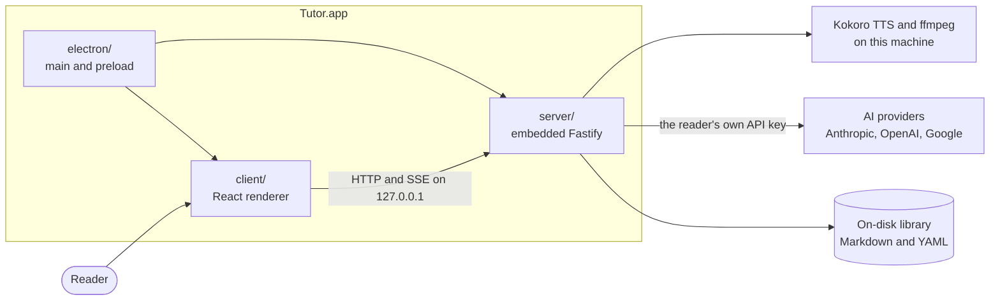
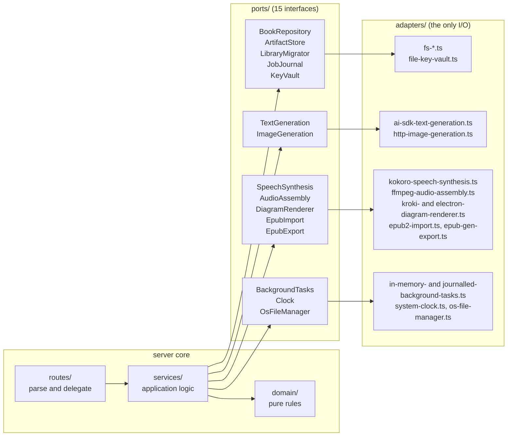
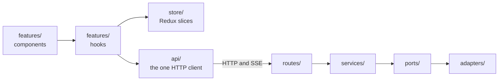
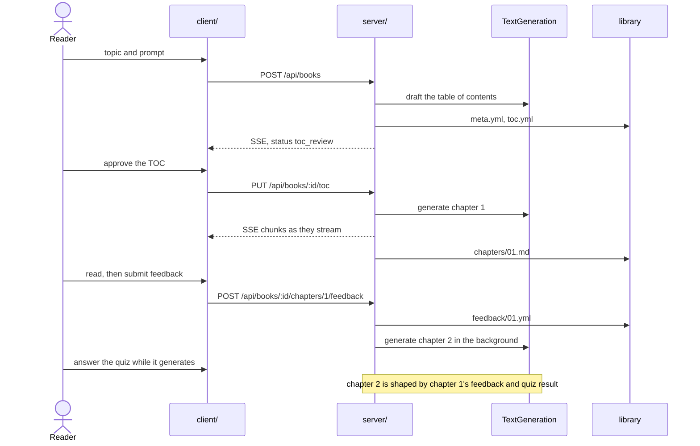
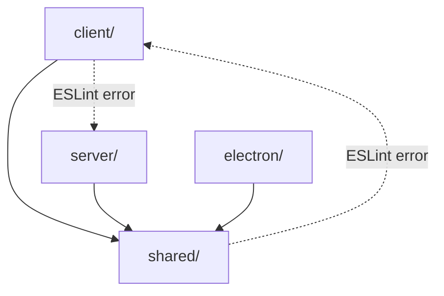

# Architecture

Tutor is one Electron desktop app for one reader on one machine. It generates a book chapter by chapter, and each chapter is shaped by the feedback and quiz results of the one before it. Everything below follows from that, and from there being exactly one writer and no cloud.

Start here, then follow the links. Domain words are defined in [CONTEXT.md](CONTEXT.md), decisions and their costs in [docs/adr/](docs/adr/README.md), and the HTTP surface in [docs/api-routes.md](docs/api-routes.md), which is generated from the route registry rather than written by hand.

## 1. What talks to what

The Fastify server is embedded in the Electron main process rather than deployed anywhere. It binds `127.0.0.1` on a free port at launch, or 3147 when run standalone with `pnpm dev:server`. The library is plain Markdown and YAML under the OS data directory, which is [ADR 0001](docs/adr/0001-filesystem-as-the-database.md). Narration is synthesized locally instead of by a metered cloud service, which is [ADR 0003](docs/adr/0003-local-kokoro-tts.md).

## 2. The server hexagon

Nothing in the core names an adapter. [`server/composition-root.ts`](server/composition-root.ts) is the one place a real adapter is chosen, and `buildServer(overrides)` lets a test or the Electron shell substitute one. Every port ships an in-memory fake and a shared contract test, and every adapter that can be exercised without spending money or downloading a model runs that same contract, which is what stops a fake from drifting into a convenient fiction. See [`server/ports/README.md`](server/ports/README.md) and [`server/adapters/README.md`](server/adapters/README.md) for the full mapping, and [ADR 0005](docs/adr/0005-ai-sdk-behind-a-port.md) for why the AI SDK sits behind one.

## 3. How a request travels

Components render and hooks decide. Every call to the server goes through [`client/api/`](client/README.md), and a raw `fetch` or `new EventSource` anywhere else is an ESLint error rather than a convention, because the client previously held eighty four scattered fetch calls and two competing reconnect policies.

## 4. The adaptive loop

Chapters are generated one at a time rather than up front, and the quiz exists partly to cover the generation latency. That is [ADR 0002](docs/adr/0002-just-in-time-chapter-generation.md). If the app is closed mid-generation the work is not lost, because jobs are journalled to disk and resumed at the next boot, which is [ADR 0008](docs/adr/0008-persisted-job-journal.md).

## 5. The dependency rule

`shared/` is the dependency root and imports neither side. It holds the Zod schemas, the status predicates, the HTTP contract types, and the SSE event unions, so the two halves of the app validate against the same definitions. This is one package shaped like a monorepo rather than real workspaces, which is [ADR 0004](docs/adr/0004-single-package-monorepo-shaped.md), and the folders are already package-shaped if that ever needs to change.

## Deliberately out of scope

Observability and telemetry, a security-hardening pass, and release engineering were all considered and declined. The app runs locally on one machine, holds one reader's data, has no cloud component, and has no multi-user surface, so each of those would add machinery with nothing to protect or measure. The reasoning is recorded in [ADR 0004](docs/adr/0004-single-package-monorepo-shaped.md) rather than left as an unexplained gap.

## Where to read next

| Area | Start at |
|---|---|
| Server, routes, services, ports, adapters | [`server/README.md`](server/README.md) |
| React renderer and feature slices | [`client/README.md`](client/README.md) |
| Types both sides depend on | [`shared/README.md`](shared/README.md) |
| Electron shell and packaging | [`electron/README.md`](electron/README.md) |
| End-to-end journeys | [`e2e/README.md`](e2e/README.md) |
| Every decision and what it cost | [`docs/adr/`](docs/adr/README.md) |
| Domain vocabulary | [`CONTEXT.md`](CONTEXT.md) |
| Generated HTTP surface | [`docs/api-routes.md`](docs/api-routes.md) |
