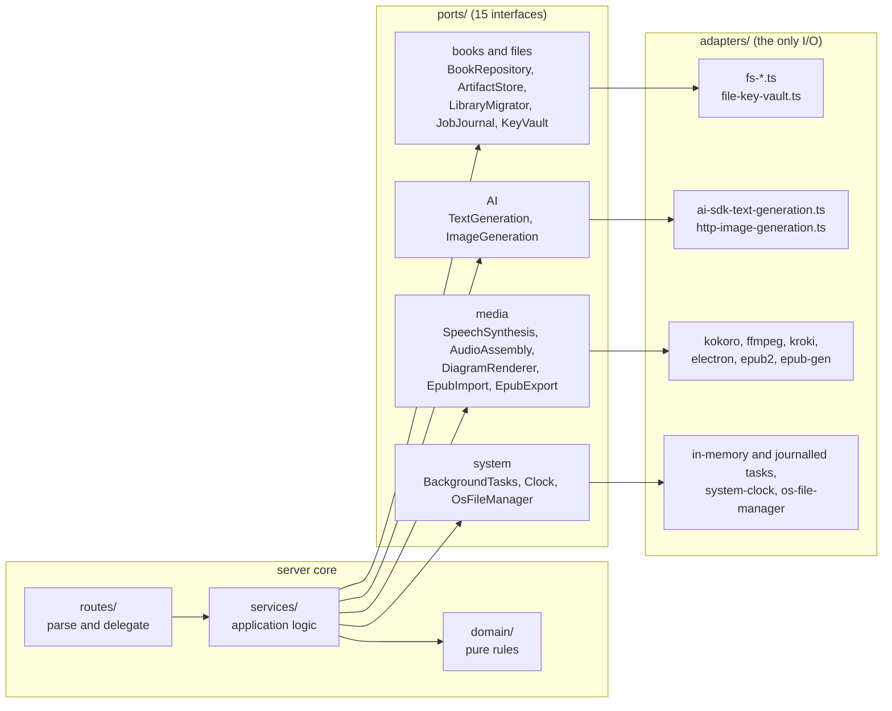
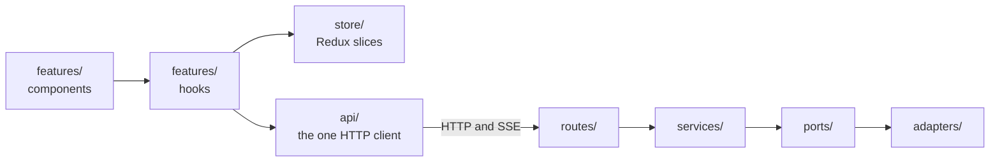
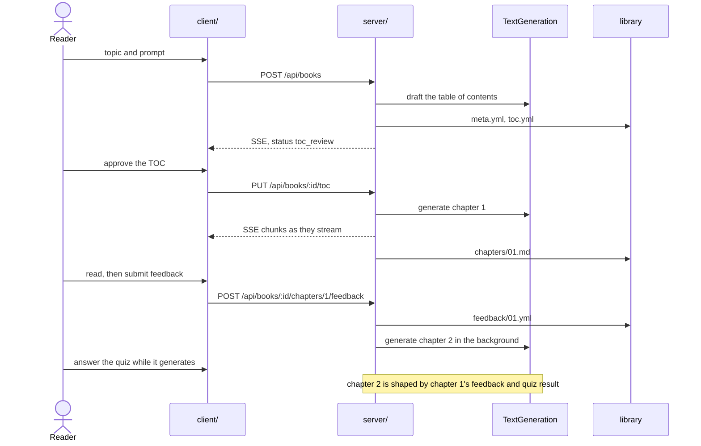
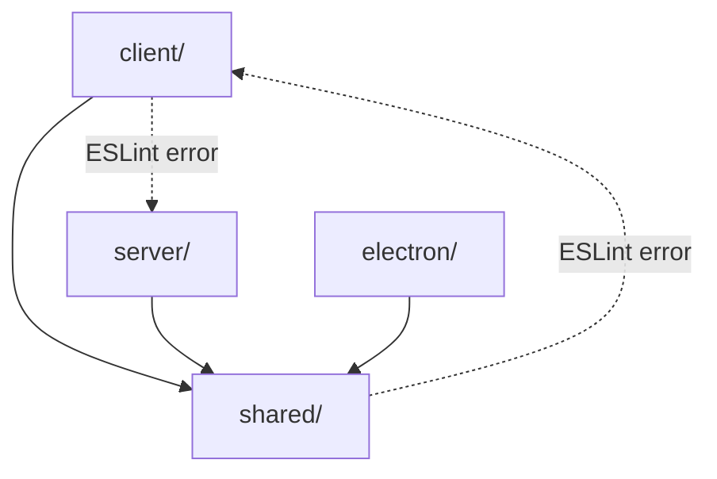

# Architecture

Tutor is one Electron desktop app for one reader on one machine. It generates a book chapter by chapter, and each chapter is shaped by the feedback and quiz results of the one before it.

Everything below follows from those two facts. There is exactly one writer, and there is no cloud.

Start here, then follow the links.

- Domain words are defined in [CONTEXT.md](CONTEXT.md).
- Decisions and what each one cost are in [docs/adr/](docs/adr/README.md).
- The HTTP surface is in [docs/api-routes.md](docs/api-routes.md), generated from the route registry, never written by hand.

## 1. What talks to what

The Fastify server runs inside the Electron main process. It is not deployed anywhere. It binds `127.0.0.1` on a free port at launch, or port 3147 when run standalone with `pnpm dev:server`.

The library is plain Markdown and YAML under the OS data directory ([ADR 0001](docs/adr/0001-filesystem-as-the-database.md)). Narration is synthesized locally instead of by a metered cloud service ([ADR 0003](docs/adr/0003-local-kokoro-tts.md)).

## 2. The server hexagon

The core never does I/O. It talks to 15 small interfaces, the ports, and each port has one or more adapters that do the real work.

The boxes inside `ports/` are just themes to keep the diagram readable. They are not layers, and they do not exist in the code. What each port actually is, and why it exists, in one line each.

**Books and files**

| Port | What it does | Why it is a port |
|---|---|---|
| BookRepository | Reads and writes the library itself, book metadata, chapters, quizzes, feedback | Services never touch `fs`, and tests run against an in-memory library |
| ArtifactStore | The binary files that belong to a book, covers, audio, EPUBs | Big blobs with their own lifecycle, kept apart from the YAML the repository owns |
| LibraryMigrator | Upgrades an older on-disk library to the current schema at boot | Works on raw YAML that may not validate yet, so it sits below the repository |
| JobJournal | One file per long-running job, so a restart can resume it | Added as a decorator, the in-memory task adapter never had to change |
| KeyVault | Stores the reader's API keys | Keys live in one place and never end up in logs or the journal |

**AI**

| Port | What it does | Why it is a port |
|---|---|---|
| TextGeneration | Every prompt to a language model, streaming and structured | The only doorway to AI in the whole app. One fake makes everything testable without a key |
| ImageGeneration | Generates book cover images | Same idea as TextGeneration with a smaller surface |

**Media**

| Port | What it does | Why it is a port |
|---|---|---|
| SpeechSynthesis | Turns chapter text into narration audio | The real model is a 100MB download. The fake keeps tests instant |
| AudioAssembly | Stitches chapter audio into one M4B audiobook | ffmpeg is a separate binary with its own failure modes |
| DiagramRenderer | Renders Mermaid blocks to images for EPUB export | The app renders offscreen in Electron, dev uses kroki. One interface hides which |
| EpubImport | Parses an uploaded EPUB into plain book data | Returns data only. Saving it is the service's job |
| EpubExport | Builds an EPUB file from rendered chapters | Wraps a CJS library with awkward packaging, quarantined here |

**System**

| Port | What it does | Why it is a port |
|---|---|---|
| BackgroundTasks | The task tray. Start a job, report progress, cancel | Long jobs outlive a request, and the UI watches them over SSE |
| Clock | The current time and fresh ids | Tests pin time instead of sleeping |
| OsFileManager | Reveals a file in Finder | The one place the app shells out to `open` |

Three rules hold all of this together.

- Nothing in the core names an adapter. [`server/composition-root.ts`](server/composition-root.ts) is the one place a real adapter is chosen, and `buildServer(overrides)` lets a test swap any of them out.
- Every port ships an in-memory fake and a shared contract test.
- Every adapter that can run without spending money or downloading a model runs that same contract test. That is what keeps a fake honest about how the real adapter behaves.

See [`server/ports/README.md`](server/ports/README.md), [`server/adapters/README.md`](server/adapters/README.md), and [ADR 0005](docs/adr/0005-ai-sdk-behind-a-port.md) for why the AI SDK sits behind a port.

## 3. How a request travels

Components render. Hooks decide.

Every call to the server goes through [`client/api/`](client/README.md). A raw `fetch` or `new EventSource` anywhere else is an ESLint error, not a convention. The client used to hold 84 scattered fetch calls and two competing reconnect policies, and the lint rule is what keeps that from coming back.

## 4. The adaptive loop

Chapters are generated one at a time, not up front, and the quiz exists partly to cover the generation wait ([ADR 0002](docs/adr/0002-just-in-time-chapter-generation.md)).

Closing the app mid-generation loses nothing. Jobs are journalled to disk and resumed at the next boot ([ADR 0008](docs/adr/0008-persisted-job-journal.md)).

## 5. The dependency rule

`shared/` is the root. It imports neither side. It holds the Zod schemas, the status predicates, the HTTP contract types, and the SSE event unions, so both halves of the app validate against the same definitions.

This is one package shaped like a monorepo, not real workspaces ([ADR 0004](docs/adr/0004-single-package-monorepo-shaped.md)). The folders are already package-shaped if that ever needs to change.

## Deliberately out of scope

Observability, a security-hardening pass, and release engineering were considered and declined. The app runs on one machine, holds one reader's data, and has no cloud component, so each of those would add machinery with nothing to protect or measure. The reasoning is in [ADR 0004](docs/adr/0004-single-package-monorepo-shaped.md) so the gap reads as a decision, not an oversight.

## Where to read next

| Area | Start at |
|---|---|
| Server, routes, services, ports, adapters | [`server/README.md`](server/README.md) |
| React renderer and feature slices | [`client/README.md`](client/README.md) |
| Types both sides depend on | [`shared/README.md`](shared/README.md) |
| Electron shell and packaging | [`electron/README.md`](electron/README.md) |
| End-to-end journeys | [`e2e/README.md`](e2e/README.md) |
| Every decision and what it cost | [`docs/adr/`](docs/adr/README.md) |
| Domain vocabulary | [`CONTEXT.md`](CONTEXT.md) |
| Generated HTTP surface | [`docs/api-routes.md`](docs/api-routes.md) |
