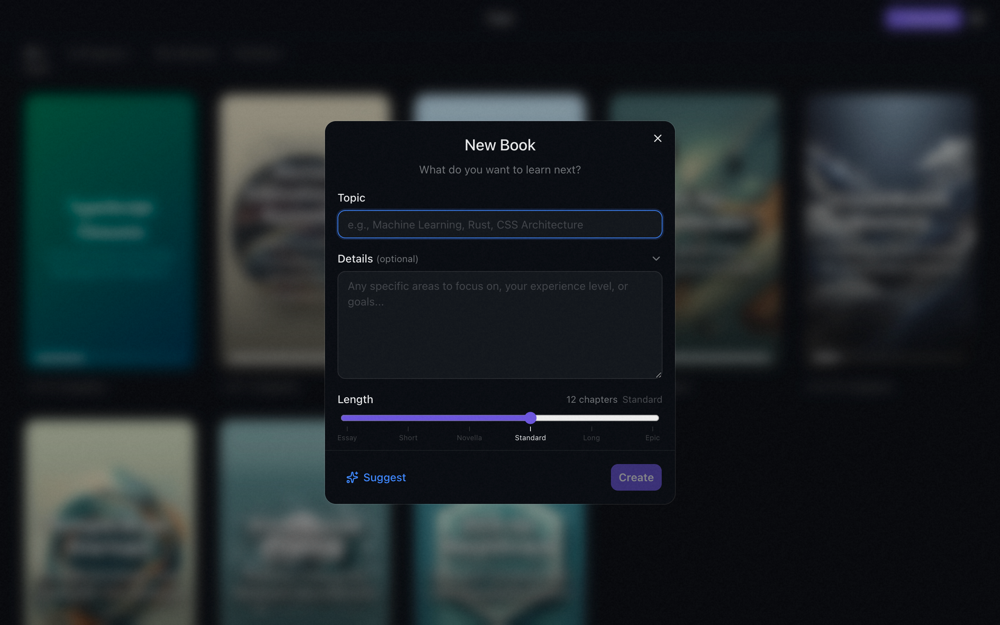
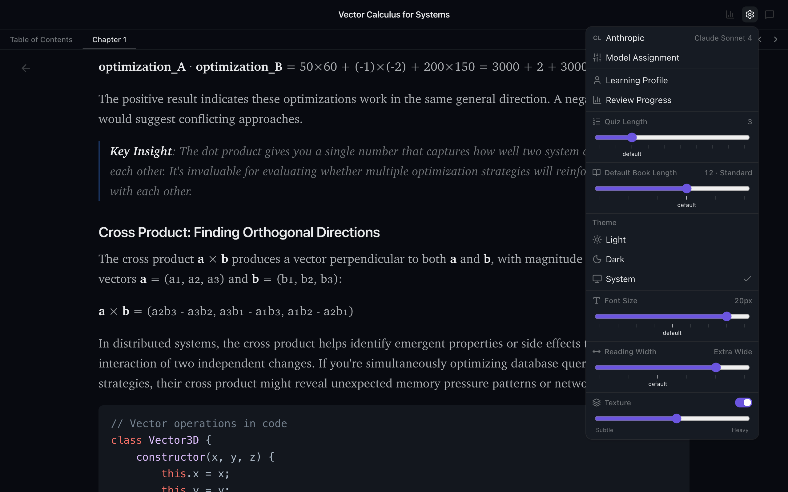
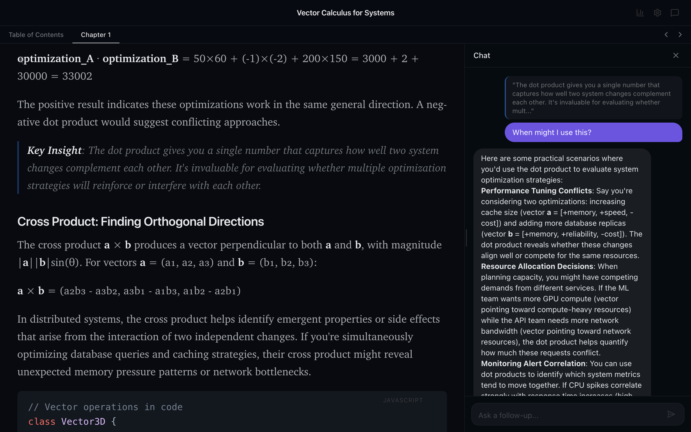
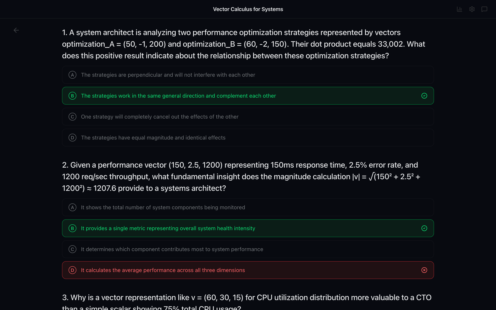
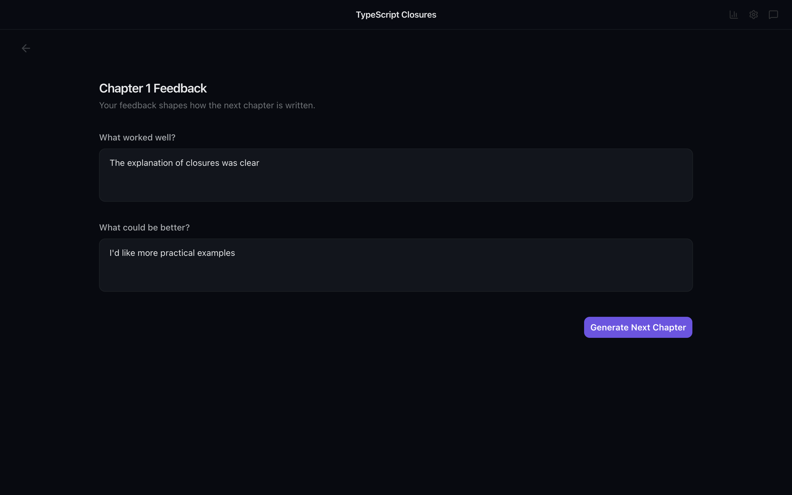
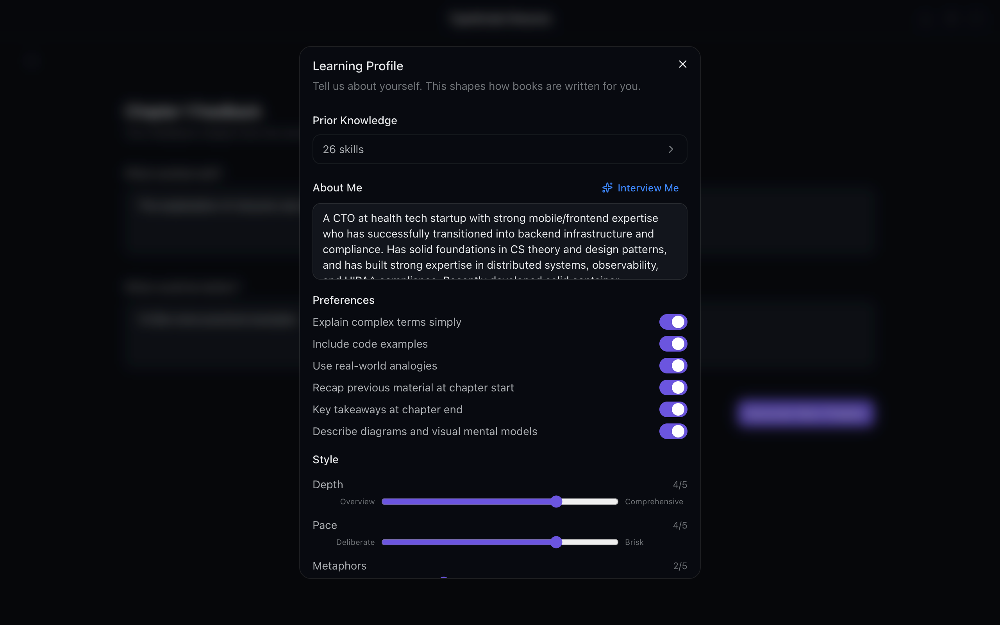
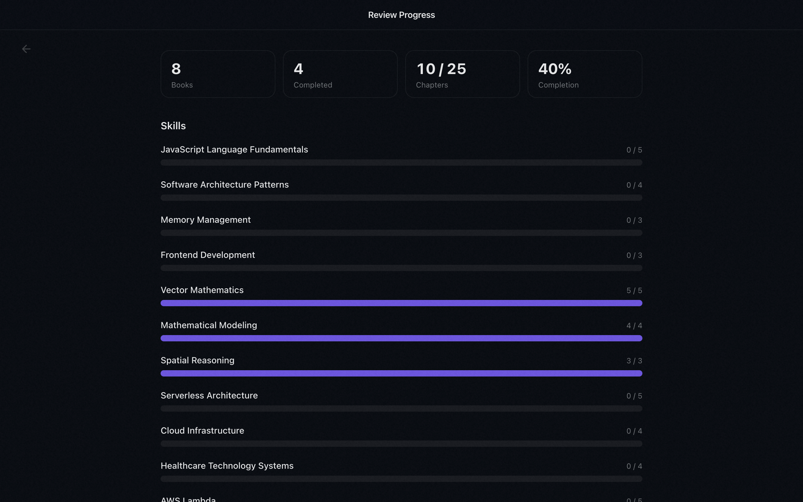

# Tutor

**AI-generated books that write themselves based on how you learn.**

Pick any topic. Tutor generates a book for you chapter by chapter — then adapts each new chapter based on your feedback and quiz performance. The books literally write itself around how you learn.

<p align="center">
  
  
</p>

## How It Works

### 1. Create

Enter a topic and a prompt describing what you want to learn. Tutor generates a table of contents and a first chapter to start.

### 2. Read

Short, focused chapters (~1,500 words, 5-10 min each). Select any text to open an inline AI chat panel for deeper explanation — then pick up right where you left off.

<p align="center">
  
  
</p>

### 3. Feedback + Quiz

After each chapter, take a quick quiz to reinforce retention. Then tell Tutor what worked and what didn't.

<p align="center">
  
  
</p>

### 4. Adapt

The next chapter is generates on-demand, incorporating your written feedback, quiz results, and your accumulated "Learning Profile". Each chapter is shaped by everything that came before it.

## Features

- **Adaptive generation** — Every chapter is shaped by your feedback, quiz performance and "Learning Profile"
- **Inline chat** — Select any text for an AI-powered deeper explanation or to chat about it
- **Quizzes** — Quick retention checks after each chapter that you can always review later
- **Learning Profile** — Set your background, preferences, depth, and pace. Tutor will interview you to make this easy to capture.
- **Update Learning Profile** — After you finish a book Tutor will automatically recommend updates to your Learning Profile based on the skills in that book and your quiz performances.
- **Skills tracking** — Discrete skills extracted from content, tracked across all your books
- **Mermaid and KATEX** — Books can show Mermaid diagrams, math forumulas (via KATEX), and code samples
- **Desktop app** — Native Electron app with dark/light theme, and lots of customizability on appearance
- **Download EPUB** — Right click on a book to download it as an EPUB
- **Generate book covers** — Right click on a book to generate a cover image for it
- **BYOK (Bring Your Own Key)** — Choose what AI models you want to use for text generation and book cover generation


<p align="center">
  
  
</p>

## Build Standalone DMG

```bash
pnpm install
pnpm electron:build
```

## Development

```bash
pnpm install
pnpm dev:server         # Keep this running one tab
pnpm electron:dev       # Run this in a different tab
pnpm test               # Run tests
```

Set your Claude, ChatGPT or Gemini API key in Settings (gear icon) on first launch.

## Tech Stack

| Layer | Choice |
|-------|--------|
| Language | TypeScript (strict) |
| Frontend | React 19 + Vite |
| UI | shadcn/ui + Tailwind CSS v4 |
| State | Redux Toolkit |
| Backend | Fastify |
| AI | Vercel AI SDK |
| Storage | Filesystem (Markdown + YAML) |
| Desktop | Electron (via vite-plugin-electron) |
| Testing | Vitest |

## Architecture

- **Filesystem storage** — Chapters are Markdown files, metadata is YAML. No database.
- **Fastify backend** — REST API with an in-memory generation queue for background chapter generation
- **React frontend** — Redux state, react-markdown rendering
- **Electron shell** — Custom window chrome, system dark mode, native packaging (DMG)

## License

[GPL-3.0](LICENSE)
