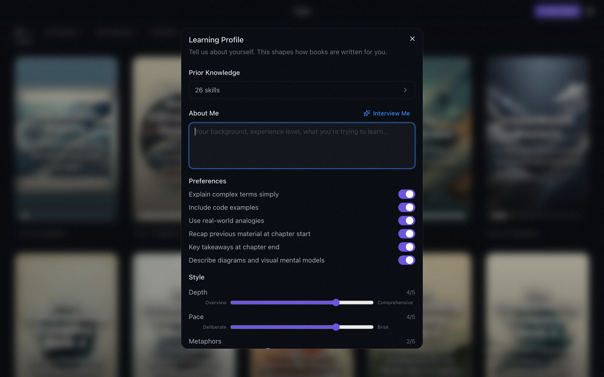

# Tutor

**AI-generated books that adapt chapter by chapter to your feedback, quiz results, and learning style.**

<p align="center">
  
</p>

## How It Works

### 01 — Personalize

Share a brief profile about how you learn, your preferences, and your prior skills. Or just have the AI interview you and it will fill those out by itself.

<p align="center">
  
</p>

### 02 — Create

Enter any topic and a learning prompt, or let the AI suggest your next book based on your learning profile, preferences, and skills. Tutor generates a table of contents and your first chapter.

<p align="center">
  
</p>

### 03 — Read

~1,500-word chapters, 5-10 min each. Select any text to open an inline AI chat for deeper explanation.

<p align="center">
  
</p>

### 04 — Quiz

Post-chapter quizzes reinforce retention. A longer quiz at the end of the book synthesizes everything across all chapters.

<p align="center">
  
</p>

### 05 — Adapt

Give feedback on each chapter. The next one adapts to your quiz results and learning profile. After you finish a book, the AI recommends updates to your skills, preferences, and profile based on your progress.

<p align="center">
  
</p>

## Features

- **GPLv3 open source** — Inspect and modify the source on GitHub
- **BYOK** — Bring your own API keys (Claude, ChatGPT, Gemini) and choose your preferred models
- **Evolving chapters** — Every chapter is shaped by your feedback, quiz performance, and learning profile
- **Inline chat** — Select any text for an AI-powered deeper explanation
- **Rich content** — Mermaid diagrams, KaTeX math formulas, and syntax-highlighted code
- **Skills tracking** — Discrete skills extracted from content, tracked and updated across all your books
- **EPUB import & export** — Export books for any e-reader, or import EPUBs others created
- **AI covers** — Generate unique cover images for any book
- **Light & dark themes** — Native Electron desktop app with system theme support

<p align="center">
  
</p>

## Build Standalone DMG

```bash
pnpm install
pnpm electron:build
```

## Development

```bash
pnpm install
pnpm dev:server         # Keep this running one tab
pnpm electron:dev       # Run this in a different tab
pnpm test               # Run tests
```

Set your Claude, ChatGPT or Gemini API key in Settings (gear icon) on first launch.

## Tech Stack

| Layer | Choice |
|-------|--------|
| Language | TypeScript (strict) |
| Frontend | React 19 + Vite |
| UI | shadcn/ui + Tailwind CSS v4 |
| State | Redux Toolkit |
| Backend | Fastify |
| AI | Vercel AI SDK |
| Storage | Filesystem (Markdown + YAML) |
| Desktop | Electron (via vite-plugin-electron) |
| Testing | Vitest |

## License

[GPL-3.0](LICENSE)
