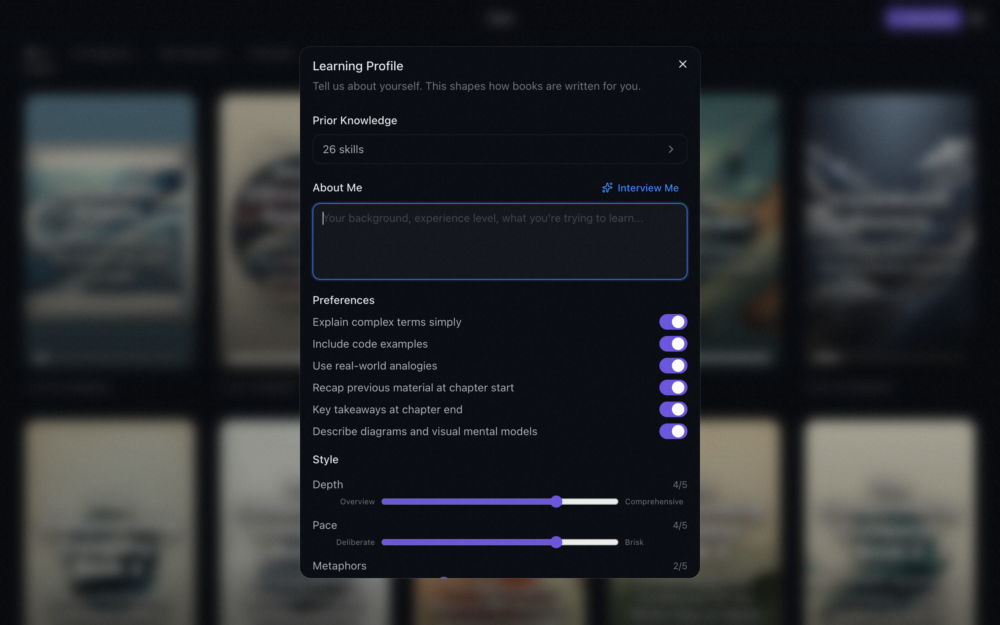
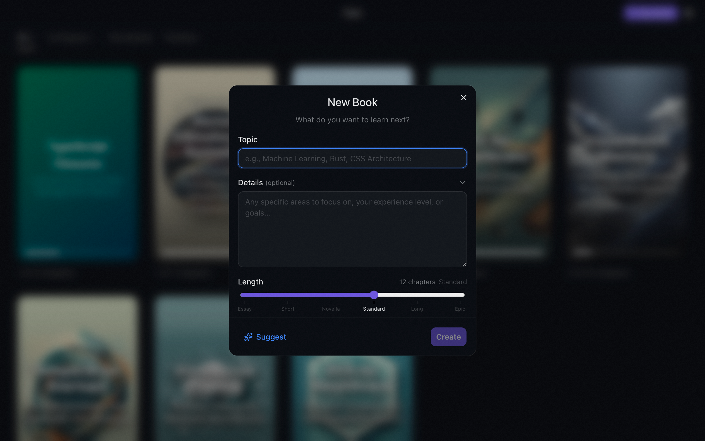
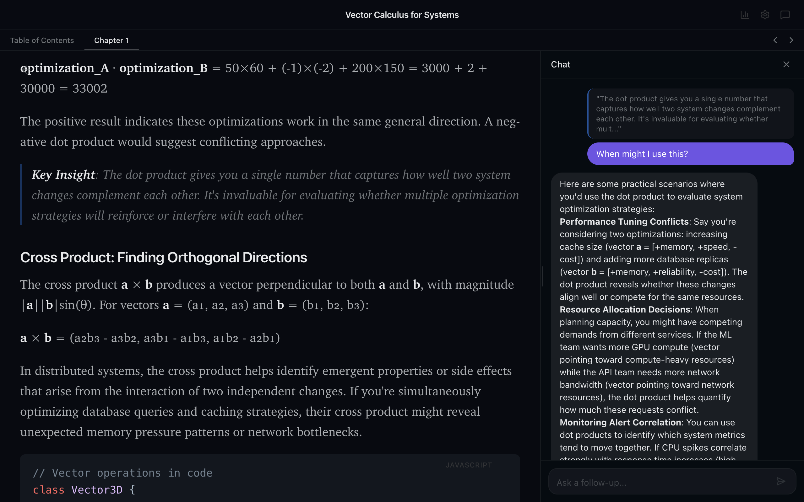
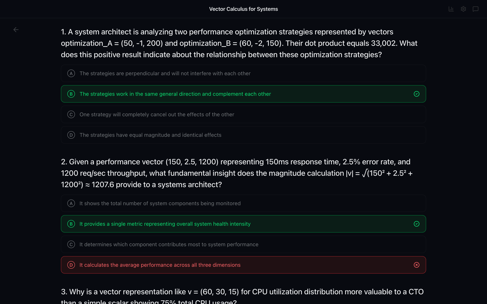
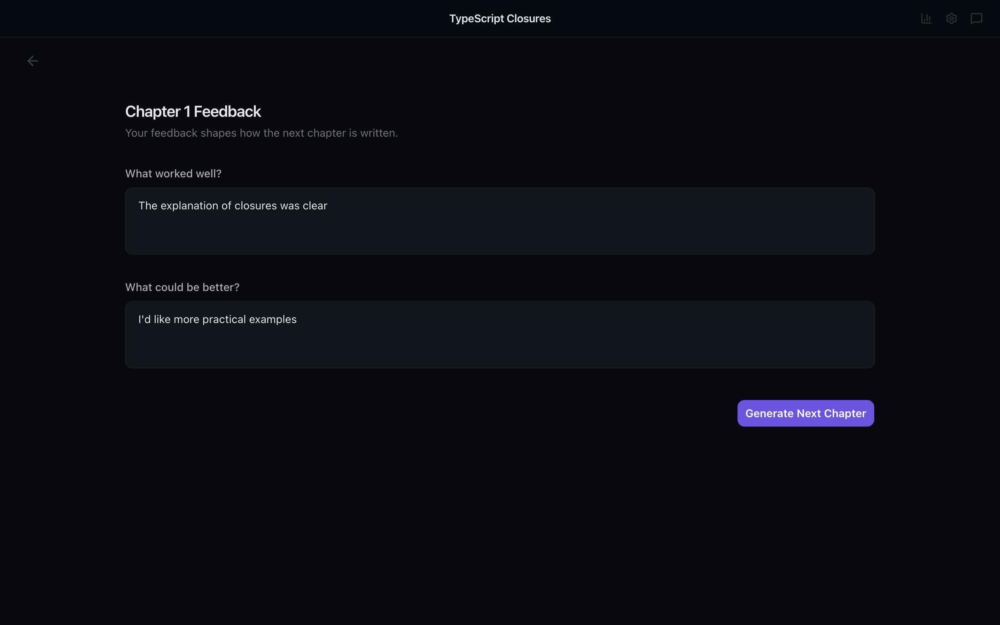
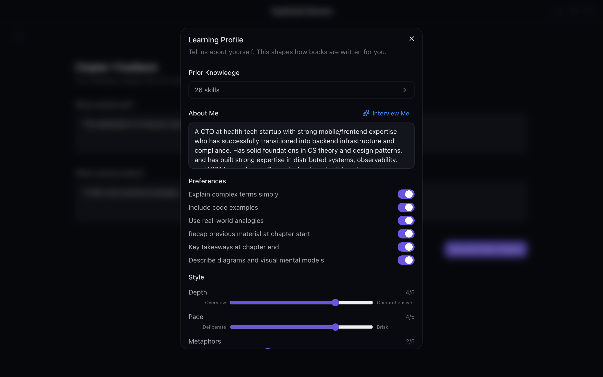

# Tutor

**Read smarter — personal tutors disguised as books.**

Books suggested and generated just for you based on your feedback, quiz results, and unique learning style.

Talks about this project live in [rsml/talks](https://github.com/rsml/talks).

Reading the code? Start at [ARCHITECTURE.md](ARCHITECTURE.md). The vocabulary is in [CONTEXT.md](CONTEXT.md) and the decisions, with what each one cost, are in [docs/adr/](docs/adr/README.md).

<p align="center">
  
</p>

<p align="center">
  🎥 <a href="https://www.youtube.com/watch?v=XIXhGluiswI"><strong>Watch the talk — "Books that Learn how your Learn"</strong></a>
</p>

<p align="center">
  📖 <a href="https://rossmiller.dev/craft/tutor/"><strong>Read a blog post on how this works</strong></a>
</p>

## How It Works

### 01 — Personalize

Share a brief profile about how you learn, your preferences, and your prior skills. Or just have the AI interview you and it will fill those out by itself.

<p align="center">
  
</p>

### 02 — Create

Enter any topic and a learning prompt, or let the AI suggest your next book based on your learning profile, preferences, and skills. Tutor generates a table of contents and your first chapter.

<p align="center">
  
</p>

### 03 — Read

~1,500-word chapters, 5–10 min each. Select any text to open an inline AI chat for deeper explanation.

<p align="center">
  
</p>

### 04 — Quiz

Post-chapter quizzes reinforce retention. A longer quiz at the end of the book synthesizes everything across all chapters.

<p align="center">
  
</p>

### 05 — Adapt

Give feedback on each chapter. The next one adapts to your quiz results and learning profile. After you finish a book, the AI recommends updates to your skills, preferences, and profile based on your progress.

<p align="center">
  
</p>

## Features

### Adaptive Learning

- **Evolving Chapters** — Quiz results and feedback shape how future chapters are written
- **Smart Review** — Spaced-repetition queue re-quizzes you on questions you missed
- **Skill Tracking** — Automatically track progress and update your learning profile

### Reading & Listening

- **Audiobook Narration** — Generate offline M4B audiobooks with chapter markers using Kokoro TTS. Multiple voices, speed control, per-chapter Listen button in the reader, and one-click export to Apple Books.
- **Inline Chat** — Select any text for a deeper AI-powered explanation
- **Rich Content** — Mermaid diagrams, KaTeX math, and syntax-highlighted code

### Library

- **Organized Library** — Search, filter, sort, tag, group into series, and drag to reorder
- **EPUB Import & Export** — Read in your favorite e-reader or import books others created
- **AI Covers** — Generate a unique AI cover for any book

### Generation

- **TOC Revision** — Iterate on the table of contents with AI before generating chapters
- **Background Generation** — Queue all chapters to generate in the background while you keep reading
- **Agentic Generation** — Built-in MCP server lets Claude Code (or any MCP client) create and edit books programmatically

### Open & Yours

- **GPLv3 Open Source** — Inspect and modify the source on GitHub
- **BYOK** — Bring your own API keys (Claude, ChatGPT, Gemini) and choose your preferred model
- **Light & Dark Themes** — Switch themes across the entire app

<p align="center">
  
</p>

## Build Standalone DMG

```bash
pnpm install
pnpm electron:build
```

## Development

```bash
pnpm install
pnpm dev:server         # Keep this running one tab
pnpm electron:dev       # Run this in a different tab
pnpm test               # Run tests
```

Set your Claude, ChatGPT or Gemini API key in Settings (gear icon) on first launch.

## Tech Stack

| Layer | Choice |
|-------|--------|
| Language | TypeScript (strict) |
| Frontend | React 19 + Vite |
| UI | shadcn/ui + Tailwind CSS v4 |
| State | Redux Toolkit |
| Backend | Fastify |
| AI | Vercel AI SDK |
| Storage | Filesystem (Markdown + YAML) |
| Desktop | Electron (via vite-plugin-electron) |
| Testing | Vitest |

## License

[GPL-3.0](LICENSE)
