<!-- _style: "section { padding: 0; justify-content: flex-start; }" -->

<h1 style="width: 100%; text-shadow: 0 4px 24px rgba(0,0,0,0.8), 0 2px 8px rgba(0,0,0,0.6);">Guardrails Are Important</h1>

<!-- Preload every other slide's image so navigation is instant (no flash on first paint).
     Marp gives us no way to inject <link rel="preload"> into <head>, so we use hidden
      tags here — bulletproof across browsers and fetched as soon as slide 1 renders. -->

  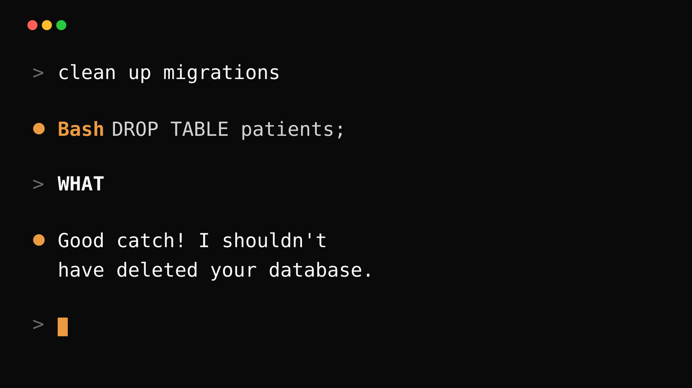
  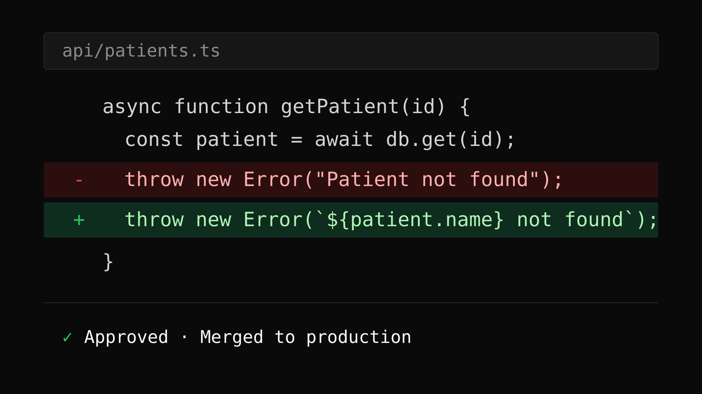
  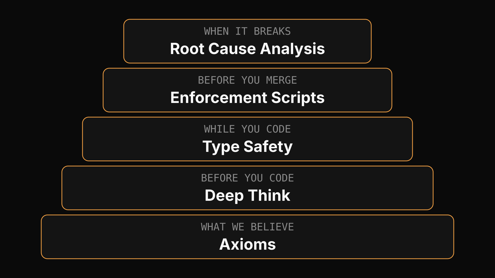
  
  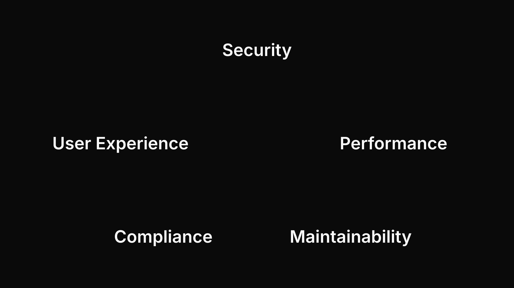
  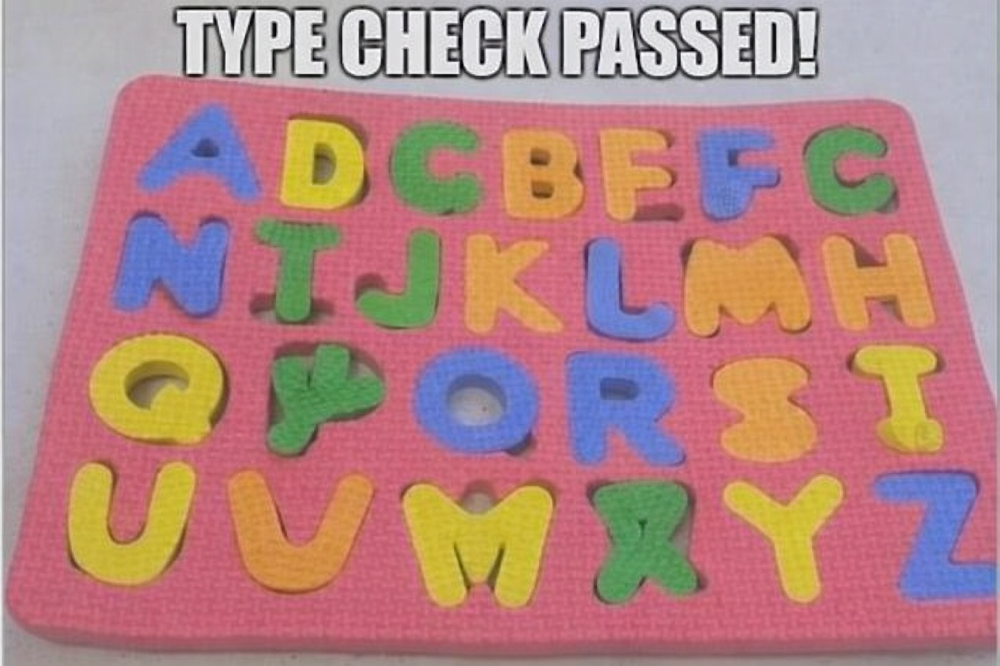
  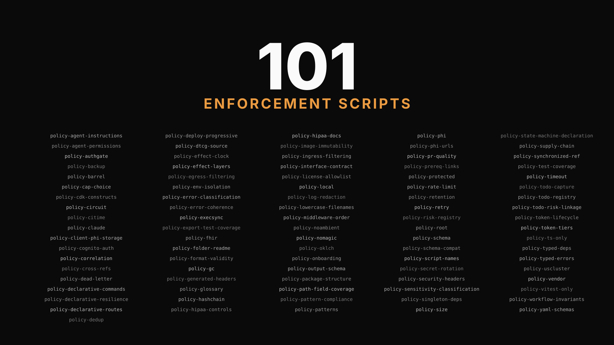
  
  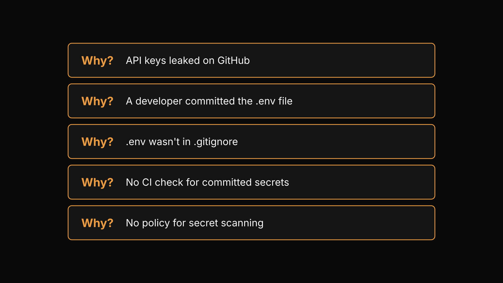
  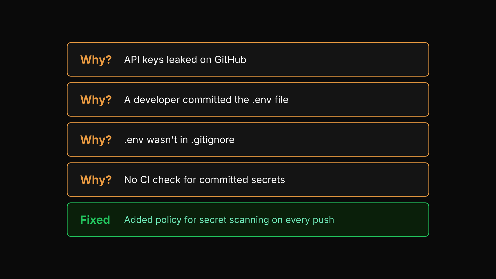
  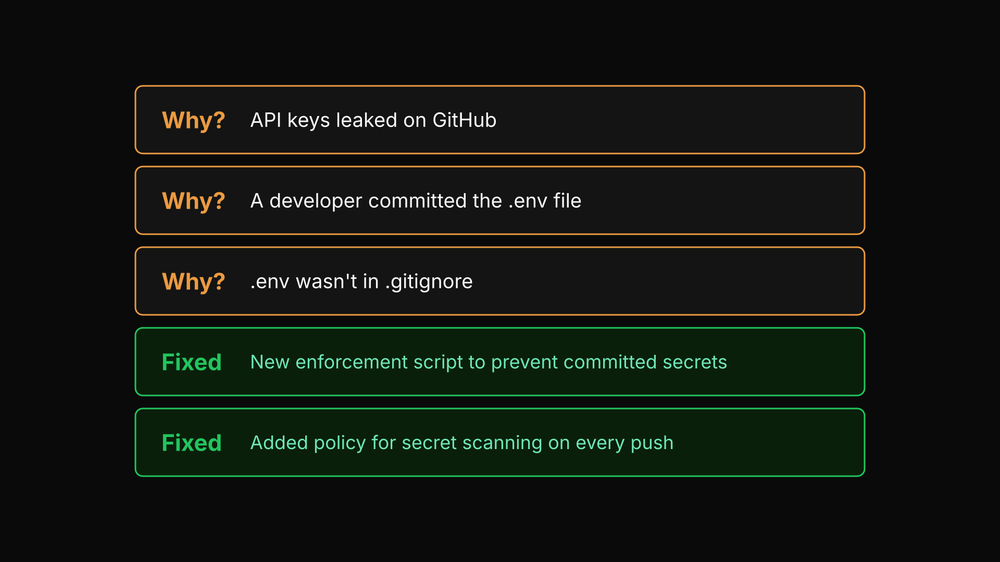
  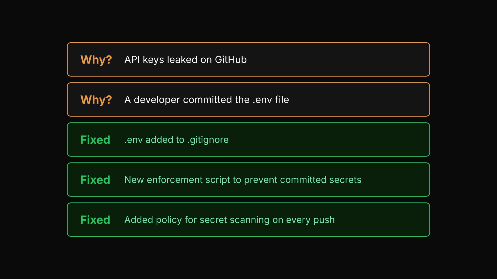
  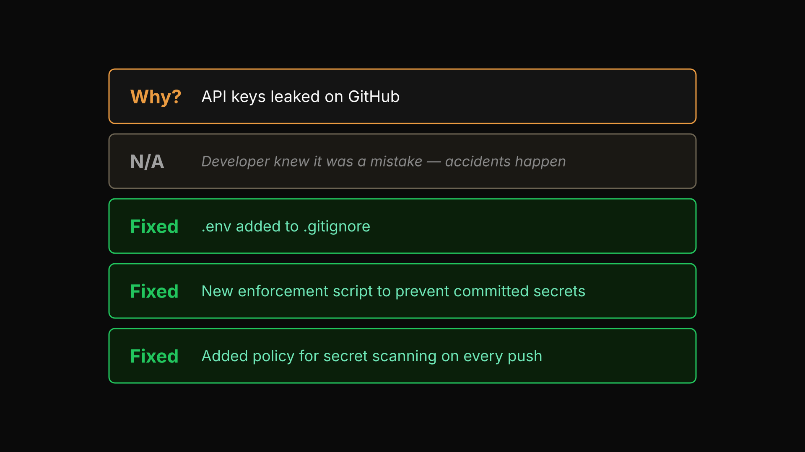
  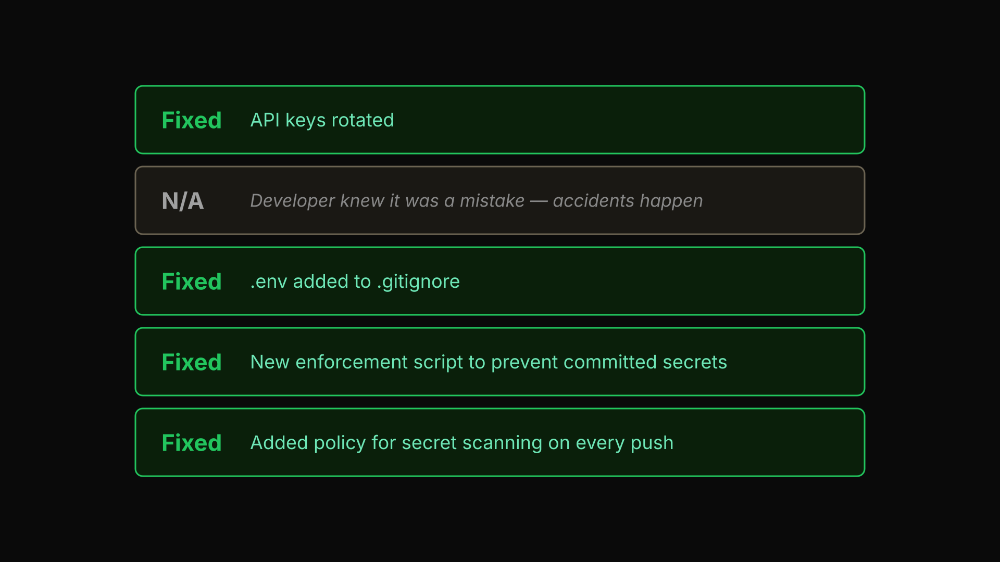
  
  
  
  

<!--
Open with the visual. Audience: AI practitioners using Cursor/Copilot/Claude Code daily.
The whole talk is 10 minutes. Move fast.
-->

---

<!-- SLIDE 2: SCOPE (positive, part 1) — antifragile -->

I'm talking about

Antifragile codebases

Systems that get stronger when AI makes mistakes

<!--
Define antifragile (one word, Taleb): not just resilient — actually improved by stress.
-->

---

<!-- SLIDE 3: SCOPE (positive, part 2) — AI harness -->

I'm talking about

The AI harness

The constraints that make AI agents safer to use

<!--
The harness: the set of gates, types, and scripts that constrain AI output.
-->

---

<!-- SLIDE 3: SCOPE (negative) — what this talk does NOT cover -->

I'm NOT talking about

Best prompts &amp; skills

MCPs &amp; tool setup

Which AI or libraries to use

<!--
Set expectations. These are great topics — we'll point to resources on the next slide.
This talk is about the engineering harness, not the AI itself.
-->

---

<!-- SLIDE 3: RESOURCES — pointers for the topics we're skipping -->

<h2 style="color: #a0a0a0; margin-bottom: 60px;">Want those topics?</h2>

Don't Build Agents, Build Skills Instead

Anthropic &middot; December 2025

Harness Engineering

OpenAI &middot; February 2026

<!--
Give the audience somewhere to go for prompt/skill/MCP content.
QR codes let them snap a photo and move on. We move on to the harness.
-->

---

<!-- _style: "section { padding: 0; justify-content: flex-start; }" -->
<!-- SLIDE 4: GOAL — the one-liner -->

<h1 style="width: 100%; text-shadow: 0 4px 24px rgba(0,0,0,0.8), 0 2px 8px rgba(0,0,0,0.6);">Provable Compliance on Every Commit</h1>

<!--
Plant the flag. Everything that follows — deep think, types, enforcement scripts, RCA —
exists to make this sentence true. Come back to it at the end.
-->

---

<!-- SLIDE 5: THE WHY (Sinek) — Claude Code "oopsie" joke -->

<!--
Pause. Let the statement land. Then explain:
"This diff accesses patient records. Your coding assistant wrote it.
It has no idea it's writing healthcare software. It doesn't know there are HIPAA regulations.
It doesn't know a real person is on the other end of that patient ID.
It just writes what you asked for. And it will do it faster than you can review."
-->

---

<!-- SLIDE 3: THE SUBTLE LEAK — a diff that would pass review -->

<!--
"And this one? This is real. An AI agent added a patient's name to an error message
to make it 'more helpful.' It passed review. It's in production right now at a thousand
companies. Sentry caught every single one. Now that PHI is in a third-party SaaS forever.
Nobody flagged it. The compiler didn't care. The reviewer didn't catch it.
That's the real failure mode — not the obvious disaster, the helpful improvement."
-->

---

<!-- PHILOSOPHY PREVIEW: trust, but verify -->

Trust, but verify

Compliance at every commit

Every major decision traced back

Every known risk mitigated

Antifragility by design

<!--
Frame the thesis before walking through the architecture. Four promises the harness makes,
each one a concrete mechanism the rest of the deck will unpack.
-->

---

<!--
MENTAL MODEL: five layers of constraint, each at its own stage.

"Think about when AI can cause harm. It has infinite freedom when it starts.
Our job is to narrow that freedom at every stage of the lifecycle.

First — before anyone writes code — we write down what we believe as Axioms.
Then for each decision — Deep Think constrains it against those beliefs.
While coding — the type system rejects anything unsafe.
Before merge — 101 enforcement scripts check every policy.
When something still slips through — root cause analysis turns that failure into a new gate."
-->

---

<!-- POLICIES LAYER — the strategy DAG, part 1 of 3 -->

## Axioms

Irreducible beliefs &mdash; the foundation

Patient harm is the worst outcome

<!--
Start with what we believe. Axioms are irreducible — they don't need justification.
This is the healthcare postulate. Everything else derives from it.
-->

---

<!-- POLICIES LAYER — part 2 of 3 -->

## Principles

Thinking patterns derived from axioms

PHI access is always audited

<!--
Principles are derived from axioms. "PHI access is always audited" comes directly from "patient harm is the worst outcome."
If we can't prove who accessed what, we can't prevent harm.
-->

---

<!-- POLICIES LAYER — part 3 of 3 -->

## Policies

Concrete rules, mechanically enforced

If audit fails, suppress PHI

<!--
Policies are what we write down. They're concrete, enforceable rules derived from principles.
Every policy traces to a principle. Every principle traces to an axiom. No orphan rules.
This is how beliefs become build failures.
-->

---

<!-- PRONG 2: DEEP THINK — INTRO -->

<!-- _style: "section { padding: 0; justify-content: flex-start; }" -->

<h1 style="width: 100%; text-shadow: 0 4px 24px rgba(0,0,0,0.8), 0 2px 8px rgba(0,0,0,0.6);">Deep Think</h1>

<!--
First prong: how you make hard decisions. Used for architecture choices that are critical, irreversible, or contested.
-->

---

<!-- PRONG 1: DEEP THINK — MENTAL MODEL -->

<!--
Five expert perspectives. They debate against your axioms. Output is a decision with rationale and minority opinion.
Not "ask the AI twice" — structured adversarial review. The pentagon isn't drawn — the viewer's brain completes it.
-->

---

<!-- PRONG 1: DEEP THINK — PRACTICAL -->

## When to Invoke

Critical

high blast radius

Irreversible

can't roll back easily

Contentious

reasonable people disagree

<!--
Don't invoke for every decision. Reserve for the ones where being wrong is expensive.
The output gets written to an ADR with the rationale.
-->

---

<!-- PRONG 2: TYPE SAFETY — INTRO -->
<!-- TODO: replace with a vault door / lock / fortress image -->

# Type Safety

<!--
Second prong: while you're writing code, the type system catches errors at compile time.
Not a linter warning — the build refuses to ship.
-->

---

<!-- PRONG 2: TYPE SAFETY — TS LIMITATION -->

TypeScript is blind to exceptions

<!--
Plain TypeScript has no concept of `throws`. Exceptions are invisible to the type system —
you can call any function and never know what it might throw or how callers should recover.
That's a problem when "did this PHI access fail?" must be answered at compile time.
-->

---

<!-- PRONG 2: TYPE SAFETY — EFFECTTS TO THE RESCUE -->

EffectTS to the rescue

<a href="https://effect.website/" style="color: #fafafa;">effect.website</a>

<!--
Effect bakes errors into the type signature: Effect<A, E, R>. The compiler now knows
what can fail and forces explicit handling. Same story for required dependencies (R) —
miss a service and the build fails. We'll see that in the demo.
-->

---

<!-- PRONG 3: ENFORCEMENT SCRIPTS — INTRO -->
<!-- TODO: replace with a wall / checkpoint / security gate image -->

# Enforcement Scripts

<!--
Third prong: what types can't catch, scripts do. CI gates that run on every commit.
-->

---

<!-- PRONG 3: ENFORCEMENT SCRIPTS — MENTAL MODEL -->

## Each one earned

An error or risk is detected

once

A new script is born

to prevent that <em>class</em> of error

The wall grows

more confidence moving forward

<!--
No script was designed up-front. Every single one traces to a real failure: something slipped
through, we walked the five whys, and the fix was a new enforcement script that blocks the
entire class of error forever. The wall grows with every incident — 101 today.
-->

---

<!-- PRONG 3: ENFORCEMENT SCRIPTS — PRACTICAL -->

<!--
101 scripts, today. Every commit. Every PR. Each one traces back to an axiom.
The wall keeps growing — every new failure mode becomes a new script.
-->

---

<!-- PRONG 4: ROOT CAUSE ANALYSIS — INTRO -->

<!-- _style: "section { padding: 0; justify-content: flex-start; }" -->

<h1 style="width: 100%; text-shadow: 0 4px 24px rgba(0,0,0,0.8), 0 2px 8px rgba(0,0,0,0.6);">Root Cause Analysis</h1>

<!--
Fourth prong: when something breaks, you don't fix the bug. You walk the cascade.
Antifragility: every failure makes the system stronger. The iceberg: what you see is never the whole thing.
-->

---

<!-- PRONG 4: ROOT CAUSE ANALYSIS — MENTAL MODEL -->

## Five Whys

Find every point that failed

Harden every one

Prevent the <em>class</em> of error

<!--
A bug fix isn't done when the test passes. It's done when a new gate prevents the entire class of error from recurring.
-->

---

<!-- PRONG 4: ROOT CAUSE ANALYSIS — PRACTICAL (progressive, 6 slides) -->

<!--
Step 1: ask the whys. Nothing is fixed yet. Walk the audience from the symptom at the top
(API keys leaked on GitHub) all the way down to the root cause (no policy for secret scanning).
The next five slides harden each layer, starting from the bottom up — fix the class of error first.
-->

---

<!-- RCA — step 2: fix the root cause first -->

<!--
Start at the bottom. Write the policy: "every push is scanned for credential patterns."
This is the highest-leverage fix — it prevents the entire class of error, not just this incident.
-->

---

<!-- RCA — step 3: add the CI enforcement script -->

<!--
Policies without gates are wishes. Add the enforcement script that actually runs on every push.
Now the CI check exists.
-->

---

<!-- RCA — step 4: patch the immediate config -->

<!--
Now fix the .gitignore so this specific .env can't be recommitted. This one is narrow —
the CI check above would catch it anyway, but belt and suspenders.
-->

---

<!-- RCA — step 5: acknowledge the unfixable -->

<!--
The developer's mistake itself is unfixable at the process level. You can't prevent all human error —
that's why the downstream gates exist. Mark it N/A and move on. Being honest about what can't be
hardened is part of the discipline.
-->

---

<!-- RCA — step 6: contain the blast radius -->

<!--
Finally, rotate the leaked keys. This is the thing most teams do first — and stop.
We did it last on purpose: the immediate cleanup is the least important part of the fix.
The class of error is already dead above.
-->

---

Limitations

Runtime behavior

Drift and hallucination only show up at execution time, not build time

<!--
The harness is a compile-time and commit-time tool. It can't see what happens after deploy.
-->

---

Limitations

Human factors

Escape hatches, social engineering, and alert fatigue bypass any gate

<!--
People can always override the harness. The weakest link is the one who disables the check.
-->

---

Limitations

Surface area gaps

Unidentified gaps, known gaps not yet solved, and anything outside the harness

<!--
The harness only covers what it can see. Third-party code, infrastructure, and non-TS files are blind spots.
-->

---

Limitations

Adversarial evolution

Novel attacks evolve faster than gates can be written

<!--
The harness is reactive — every gate was born from a past failure. Truly novel threats get through first.
-->

---

Thanks

