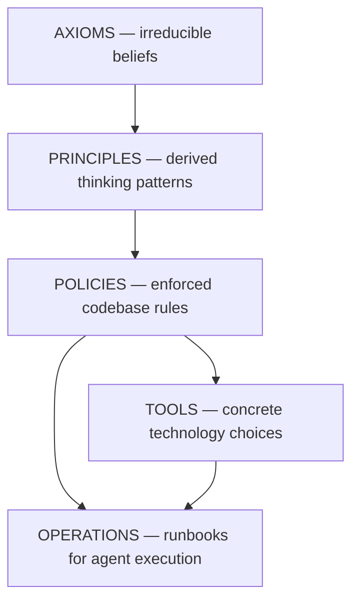

# AI Harness: Compile-Time Compliance for Healthcare Software

**Companion guide to the meetup talk**

---

## What Is an AI Harness?

An AI harness is a system of **mechanical constraints** that prevent AI coding agents from violating safety invariants.

Not prompts. Not documentation. Not code review.

Compiler-enforced gates.

The distinction matters because AI agents generate code at a pace where social enforcement collapses. If your only defense against a HIPAA-alignment violation is "the code reviewer will catch it," you are one missed review away from a breach. A compiler error is not missable.

The harness is the set of type constraints, CI scripts, and shell guards that make unsafe code literally unwritable — or at minimum, impossible to ship.

---

## The Strategy DAG

Every constraint in the harness traces back to an axiom. No orphan nodes.



Our strategy document hierarchy:

- **7 axioms** — irreducible beliefs about what matters (e.g., "patient harm is the worst outcome")
- **~25 principles** — thinking patterns derived from axioms (e.g., "PHI isolation", "enforcement drift")
- **~45 policies** — enforced codebase rules derived from principles (e.g., `POLICY-AUDIT`, `POLICY-FAILAUDIT`)
- **Tools** — concrete technology choices, each tracing to a policy
- **Operations** — runbooks the agents (and humans) actually execute

The DAG is validated on every commit. An orphan policy — one with no `derived-from` principle — fails the build.

---

## Three Axiom-to-Enforcement Traces

### Trace 1: Patient Harm → Audit Trail

**Axiom:** Patient harm is the worst outcome.

**Principle:** PHI isolation, audit trails, and compliance automation exist because this axiom is true. If patient harm is the worst outcome, then every access to patient data must be traceable and revocable.

**Policies:**

- `POLICY-AUDIT`: Every PHI access emits auditable events.
- `POLICY-FAILAUDIT`: If the audit write fails, suppress the PHI response.

**Enforcement:** The `requireAuditedPhiAccess` function's type signature requires `AuditSink` in the Effect's `R` (requirements) channel. If you omit it, the code does not compile. If the audit write fails at runtime, `AuditFailureError` is returned in the `E` (error) channel and the actor is never returned to the caller.

---

### Trace 2: Enforcement Drift → CI Gates

**Axiom:** What isn't mechanically enforced will drift.

**Principle:** Social enforcement — code review, naming conventions, documented guidelines — drifts under pressure, fatigue, and team turnover. Only type systems, CI gates, and enforcement scripts are reliable over time.

**Policy:** `POLICY-EFFECT-LAYERS`: Dependencies are composed via Effect Layers. A missing dependency is a compile error, not a runtime crash.

**Enforcement:** 101 enforcement scripts run on every commit. Build fails if any policy is violated. These are not linter warnings — a violation is a build failure. The agent cannot ship the code.

---

### Trace 3: Bounded Context → Singleton Dependencies

**Axiom:** Reliable reasoning requires bounded context.

**Principle:** Neither humans nor AI agents can reason correctly about unbounded information. The more things a component can import, the harder it is to reason about what it does and what it could break.

**Policy:** `POLICY-SINGLETON-DEPS`: All Effect imports come from `@sylvan/core`, never from `effect` directly.

**Enforcement:** `policy-singleton-deps.ts` scans every file's imports and fails the build if any file imports from `effect` directly instead of through the shared re-export. This prevents version skew and ensures a single Effect instance across the monorepo — a class of runtime bug that is nearly impossible to diagnose after the fact.

---

## The Centerpiece: `requireAuditedPhiAccess`

This is the function that embodies the harness in one signature. Every AI-generated handler that touches patient data must go through it, and the type system enforces that.

```typescript
export const requireAuditedPhiAccess = (
  params: PhiAccessParams
): Effect.Effect<
  AuthActor,                    // A: Success — authenticated actor
  | AuthenticationError         // E: not authenticated
  | ForbiddenError              // E: wrong role
  | ObjectAuthorizationDenied   // E: object-level denied
  | AuditFailureError,          // E: audit write failed (POLICY-FAILAUDIT)
  AuditSink | AuthContext | ObjectAuthorizer  // R: required services (compile-time)
>
```

### The Three Effect Channels

| Channel            | Meaning                                        | What it enforces                                                    |
| ------------------ | ---------------------------------------------- | ------------------------------------------------------------------- |
| `A` (success)      | Returns `AuthActor` only after all checks pass | Nothing is returned until auth + audit succeed                      |
| `E` (errors)       | Every failure mode is a typed, tagged error    | No thrown exceptions; all failures are visible in the signature     |
| `R` (requirements) | Three services MUST be provided                | Missing a service = compile error. Not a convention — a type error. |

### The Pipeline (Steps in Order)

```
1. AuthContext.getActor        → authenticate the caller
2. AuthContext.requirePermission → RBAC check
3. ObjectAuthorizer.gate       → object-level authorization
4. AuditSink.write             → emit auditable event
5. return actor                → only reachable if ALL four steps succeeded
```

Step 5 is unreachable unless steps 1–4 all succeed. The type system proves this, not a code comment.

An AI agent generating a new PHI endpoint cannot skip the audit step. If it tries to call the handler without wiring `AuditSink` into the Layer, the build fails. The agent gets a compiler error, not a runtime incident.

---

## Agent Permission Hooks

Beyond the type system, we use shell-level guards that intercept AI agent actions before they execute.

### The Guard Script

```bash
#!/usr/bin/env bash
# Blocks destructive shell commands before AI agents can execute them
set -euo pipefail
COMMAND=$(jq -r '.tool_input.command // empty' < /dev/stdin)
if [ -z "$COMMAND" ]; then exit 0; fi

check_pattern() {
  local pattern="$1" reason="$2"
  if echo "$COMMAND" | grep -qEi "$pattern"; then
    echo "BLOCKED: ${reason}" >&2
    exit 1
  fi
}

check_pattern 'rm -(r|rf|fr) '          "Recursive deletion"
check_pattern 'git push .*(--force|-f)'  "Force push"
check_pattern 'git reset --hard'         "Hard reset"
check_pattern 'DROP (TABLE|DATABASE)'    "Database destruction"
```

### Hook Registration

```json
{
  "hooks": {
    "PreToolUse": [
      {
        "matcher": "Bash",
        "hooks": [
          {
            "type": "command",
            "command": "scripts/hooks/pre-bash-guard.sh",
            "timeout": 5
          }
        ]
      }
    ]
  }
}
```

Every shell command the AI agent attempts passes through this guard **before execution**. The agent never has the chance to run the command — it's intercepted at the framework level. This is a mechanical control, not a prompt instruction like "don't delete files."

Prompt instructions can be overridden by a sufficiently confused model. A shell interceptor cannot.

---

## Build Your Own Harness — 3 Steps

### Step 1: Identify Your Riskiest AI Code Path

What's the thing your AI agent could break that would cost the most?

- Data deletion without recovery?
- Auth bypass?
- PII written to logs?
- API key leaked in a response?

Pick **one**. The harness starts with the highest-impact risk. You can add more later.

---

### Step 2: Make the Safety Property a Type

Express the invariant in your type system so it can be checked at compile time.

| Risk                          | Type encoding                                                                    |
| ----------------------------- | -------------------------------------------------------------------------------- |
| "User must be authenticated"  | Branded `AuthenticatedUserId` type — raw `string` is rejected at call sites      |
| "Input must be sanitized"     | `SanitizedHtml` branded type — raw `string` cannot flow into the renderer        |
| "Access must be audited"      | Effect `R` channel requires `AuditSink` — missing it = compile error             |
| "Query must be parameterized" | Only accept `ParameterizedQuery` type — raw SQL string type-errors at the driver |

The key property: the safe version and the unsafe version are **different types**. The compiler can tell them apart.

---

### Step 3: Make Its Absence a Build Failure

The type must be **required** at the call site. If it is missing, the build fails. Not a warning. Not a lint note. A compiler error.

Options in roughly increasing enforcement strength:

1. **Function parameter typing** — function accepts `AuthenticatedUserId`, not `string`. Caller must prove authentication before calling.
2. **Effect R-channel requirement** — handler requires `AuditSink` in its layer. Missing layer = compile error. Works even if the AI generates an entirely new file.
3. **CI enforcement script** — script scans for banned patterns (raw SQL, direct `effect` imports, `any` types). Runs on every commit. Build fails on violation.
4. **Shell-level hook** — intercepts agent tool calls before execution. Operates outside the codebase entirely.

Use as many layers as the risk warrants.

---

## Honest Limitations

This approach is powerful but not complete. Here is what it cannot catch:

**Runtime behavior drift.** Types check at compile time. If a service behaves differently at runtime than its type promises — a dependency that claims to write to an audit log but silently swallows errors — the harness cannot detect it. Mitigated by: integration tests, observability, contract tests against real service behavior.

**LLM hallucination in clinical advice.** If your AI generates clinical content recommendations, type systems cannot validate medical accuracy. A function that returns `ClinicalRecommendation` is correctly typed; the content inside that value may still be wrong. Mitigated by: human-in-the-loop review, clinical validation pipelines, clear scope limits on what AI can output.

**Social engineering and deliberate circumvention.** A developer (or AI) could deliberately escape the type system using `any` casts, `@ts-ignore`, or by patching enforcement scripts. Mitigated by: lint rules banning `any` (scanned by CI), `@ts-ignore` banned by policy, enforcement scripts themselves checked into version control and reviewed like any other code.

**Administrative process gaps.** Controls addressing HIPAA requirements include ongoing human processes: access reviews, workforce training, incident response drills, business associate agreements. Type systems don't establish human processes. Mitigated by: documented runbooks, scheduled review cadences, and — critically — filing TODOs for process establishment whenever a new code control is added. Code TODOs are not sufficient; process TODOs are separate.

The harness reduces the blast radius of AI mistakes. It does not eliminate the need for human judgment about clinical accuracy, regulatory strategy, or incident response.

---

## Further Reading

- [Effect-TS](https://effect.website) — The type system powering compile-time dependency enforcement. The `R` channel pattern is the core mechanism behind `requireAuditedPhiAccess`.
- [Marp](https://marp.app) — Markdown presentation tool used to build this talk's slides.
- "Parse, Don't Validate" by Alexis King — The foundational idea behind using types as proof rather than runtime checks. If you read one thing after this talk, read this.
- "Domain Modeling Made Functional" by Scott Wlaschin — Practical type-driven design in a language that will feel familiar to TypeScript developers.
- HIPAA Security Rule (45 CFR Part 164) — The regulation driving the controls described here. The audit controls in §164.312(b) are directly what `POLICY-AUDIT` and `POLICY-FAILAUDIT` address.

---

_Questions? Find us after the talk or open an issue at the repo linked on the final slide._
