## Design the Blanks

Building AI products that compound

<!--
"I built an AI learning app. Books generated by AI, tailored to how you learn.
I'm going to demo it, then share a framework for thinking about AI product design."

LIVE DEMO (3 min):
1. Show the library — books with AI covers, progress bars (20s)
2. Create a new book — enter a topic and prompt (30s)
3. AI generates a table of contents — reorder a chapter, approve (30s)
4. Open a chapter — scroll, show formatting and diagrams (30s)
5. Click a sentence — inline chat slides out, ask a question, dismiss (30s)
6. Finish chapter — quiz appears, answer one wrong on purpose (20s)
7. Give feedback — "too abstract, more examples" (20s)
8. Show next chapter — opens with a recap of what you got wrong (20s)
9. Flash the EPUB export and AI cover generation (20s)
-->

---

## Your product is a Mad Lib

Some parts are fixed. Some parts are AI.

You design the blanks.

<!--
"Here's the framework. Think of your product as a Mad Lib.

The structure is yours — the flow, the constraints, the format.
The blanks are where AI fills in — personalized, adaptive, contextual.

The magic isn't in the AI. It's in which blanks you choose,
what shape you give them, and what signals you feed back in.

Let me walk you through the nine blanks in Tutor."
-->

---

<!-- _style: "section { padding: 0; }" -->

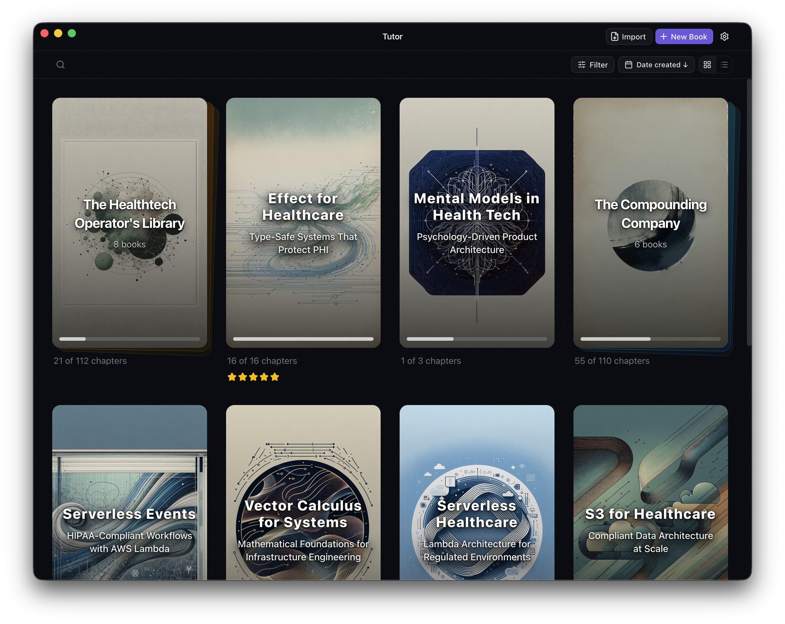

TODO: Annotate — fixed parts vs AI-generated blanks

<!--
"This is the whole app in one view.
The structure is fixed — chapters, quizzes, progress, navigation.
The content is AI — personalized to every reader.

Nine blanks. Let's walk through each one."
-->

---

<!-- BLANK 1: THE INTERVIEW -->

## The Interview Blank

AI asks how you learn before it teaches you anything

<!--
"Before generating a single word, the app interviews you.
How do you learn best? What's your background? Visual or textual?

This is the cheapest blank to fill — a few questions —
and it shapes everything that comes after.

Most AI products skip this. They generate for a generic user.
This one generates for you."
-->

---

<!-- _style: "section { padding: 0; }" -->

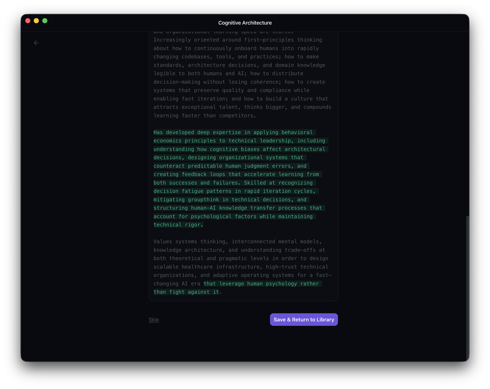

<!--
Show the learning profile screen.
"Three questions. Zero content generated yet. Maximum signal."
-->

---

<!-- BLANK 2: THE SUGGESTION -->

## The Suggestion Blank

AI suggests what to learn next based on what you know

<!--
"You open the app. AI already has a suggestion.
Based on your profile, your reading history, your skill gaps.

The user doesn't have to figure out what to learn next.
The blank is small — just a suggestion — but it removes
the biggest friction point: 'what should I study?'"
-->

---

<!-- _style: "section { padding: 0; }" -->

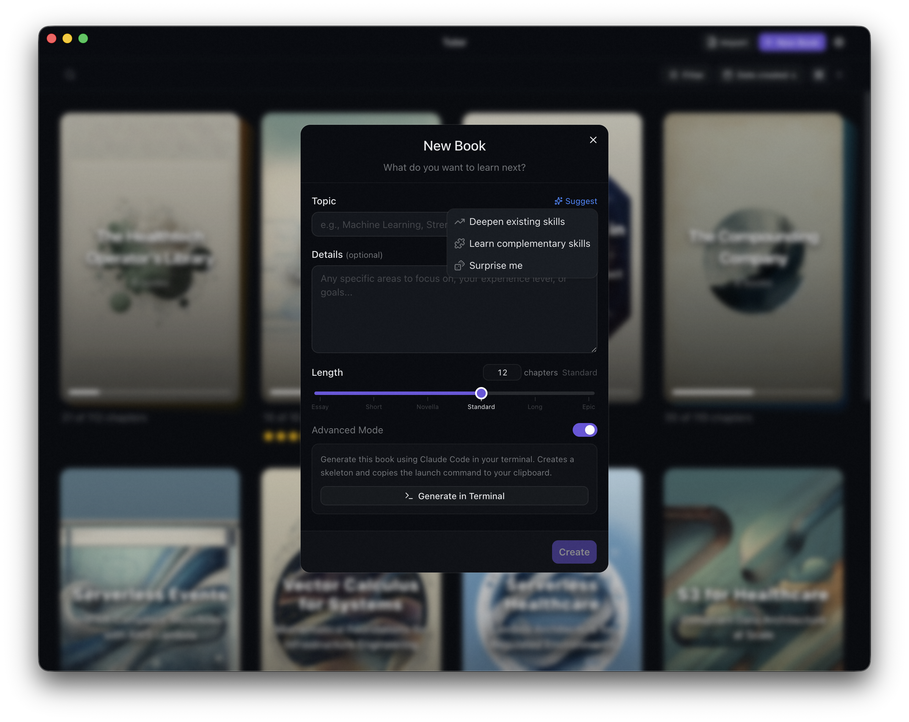

<!--
Show the AI suggestion dropdown: "Deepen existing skills", "Learn complementary skills", "Surprise me."
"You click Suggest and the AI — knowing your profile — offers three directions."
-->

---

<!-- _style: "section { padding: 0; }" -->

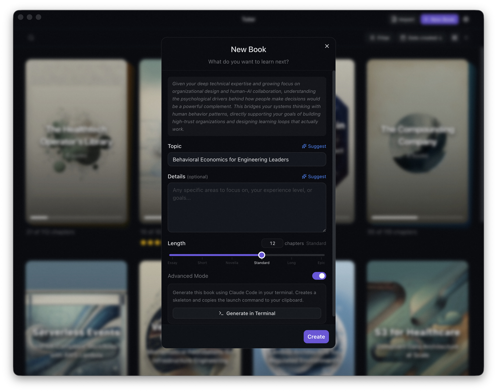

<!--
Show the result: topic and description filled in by AI.
"One click. Topic chosen. Description written. Ready to create."
-->

---

<!-- BLANK 3: THE COVER -->

## The Cover Blank

The moment it becomes "mine"

<!--
"AI generates a cover. Unique to your book, your topic.

This is a tiny blank — cosmetic, even. But it crosses a line
most AI products never reach. People say 'my book on economics.'
Nobody says 'my ChatGPT response about economics.'

The cover is why. It makes the output feel like an artifact,
not a response."
-->

---

<!-- _style: "section { padding: 0; }" -->

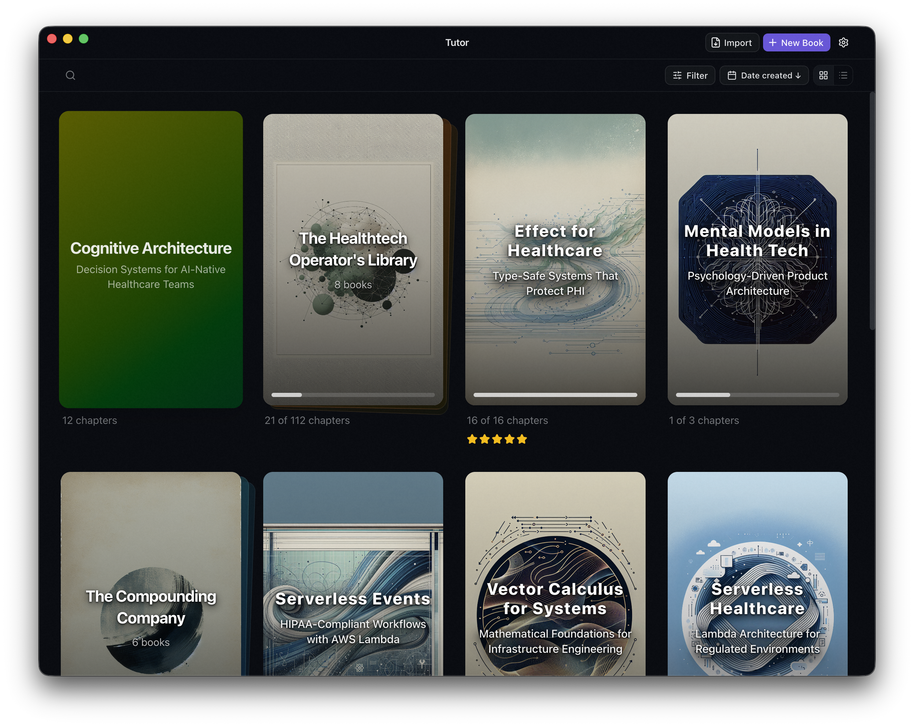

<!--
Show the library with one book that has a plain colored cover — no AI image yet.
"Before the cover. It's a book, but it doesn't feel like yours yet."
-->

---

<!-- _style: "section { padding: 0; }" -->

<!--
Show the library with all AI-generated covers.
"After. Each cover is unique. Each book feels like yours.
A tiny blank — but it's the moment the output becomes an artifact."
-->

---

<!-- BLANK 4: THE TOC -->

## The TOC Blank

Steer before it's expensive

<!--
"You create a book. AI generates a table of contents.
12 proposed chapters. You can reorder, remove, add. Then approve.

30 seconds editing an outline saves hours of wrong chapters.
AI proposes. You approve. Then the expensive work begins."
-->

---

<!-- _style: "section { padding: 0; }" -->

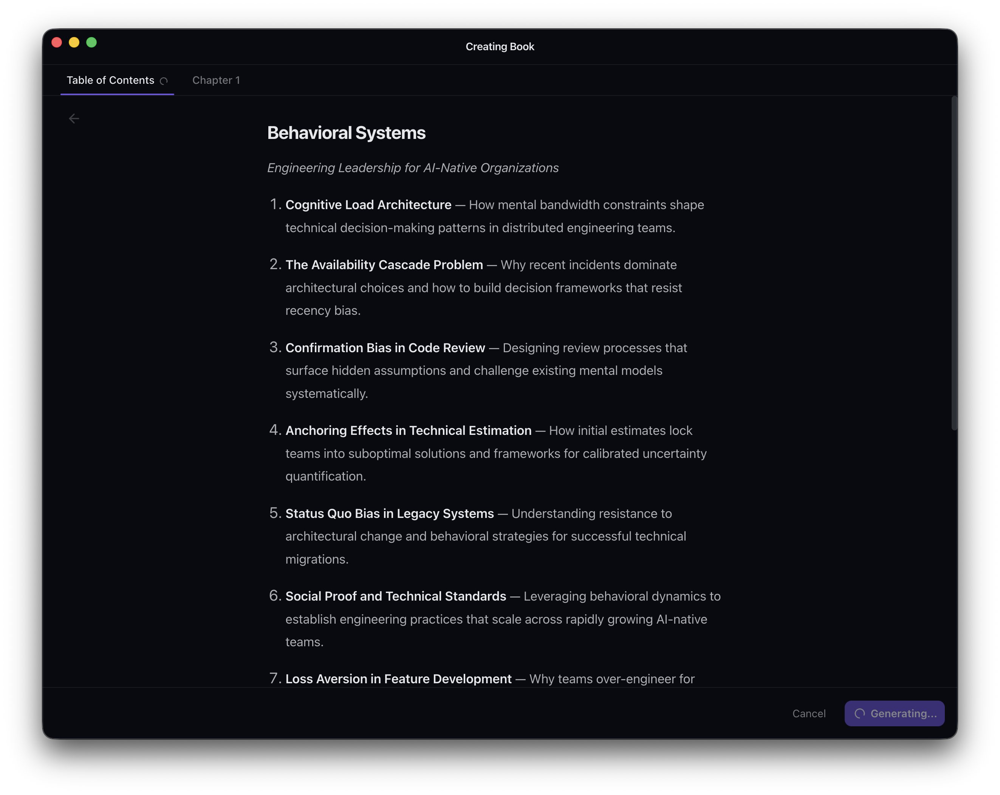

<!--
Show the TOC approval wizard.
"Drag to reorder. Delete what you don't want. Add what's missing.
30 seconds here. Then you click approve and generation begins."
-->

---

## Where's the gate in your product?

Every AI product has a highest-leverage moment for the user to say "yes, go" or "no, change course"

Put the gate there.

<!--
"Where's the highest-leverage moment in your product
for the user to steer before it gets expensive?

That's where you put the gate. That's a blank worth designing carefully."
-->

---

<!-- BLANK 5: THE CHAPTER -->

## The Chapter Blank

The narrower the task, the better the output

<!--
"~1,500 words. One specific topic from the approved outline.
Shaped by your quiz results, your feedback, your learning profile.

'Write me a book about economics' — generic filler.
'Write chapter 4 on supply and demand for a visual learner
who got two questions wrong about pricing' — genuinely good.

You don't need better prompts. You need better product design.
Narrow the blank."
-->

---

<!-- _style: "section { padding: 0; }" -->

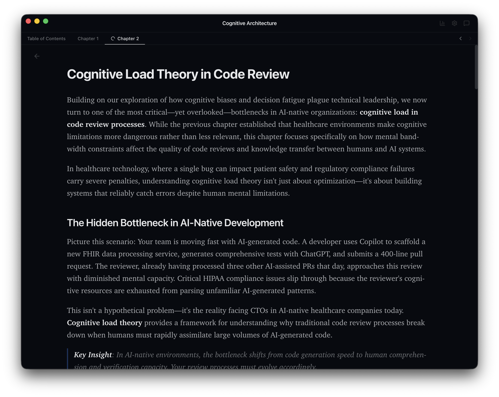

<!--
Show a chapter with rich formatting, diagrams, code blocks.
"1,500 words. Specific. Contextual. Not a wall of generic text."
-->

---

<!-- BLANK 6: THE QUIZ -->

## The Quiz Blank

Wrong answers are the most valuable signal

<!--
"After every chapter: three questions testing what you just read.

This blank does double duty.
For the user: the struggle to recall makes it stick.
For the product: wrong answers tell the AI exactly what you didn't understand.

Most products treat failure as a dead end.
This one treats it as a gift — it feeds the next chapter."
-->

---

<!-- _style: "section { padding: 0; }" -->

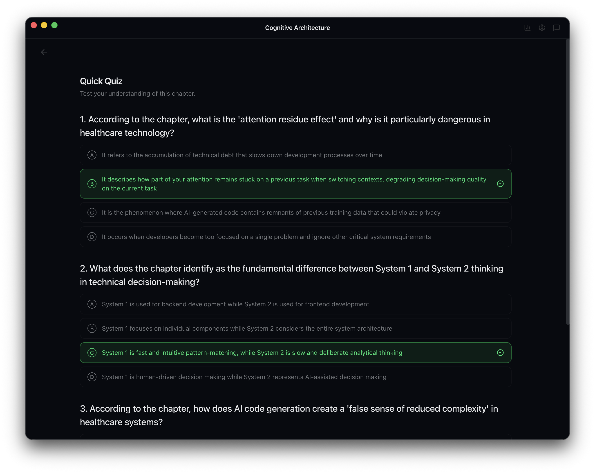

<!--
Show the quiz panel.
"Get one wrong — that's the most useful thing that happened today.
The next chapter opens with a recap of exactly what you missed."
-->

---

<!-- BLANK 7: THE FEEDBACK -->

## The Feedback Blank

Every interaction feeds the next generation

<!--
"After the quiz: 'What worked? What didn't?'
'Too abstract.' 'More examples.' 'Loved the diagrams.'

This is the user explicitly telling the AI how to improve.
Submitting feedback triggers the next chapter in the background.

The loop closes. Read, quiz, feedback, generate.
Each cycle, the book gets smarter about you."
-->

---

<!-- _style: "section { padding: 0; }" -->

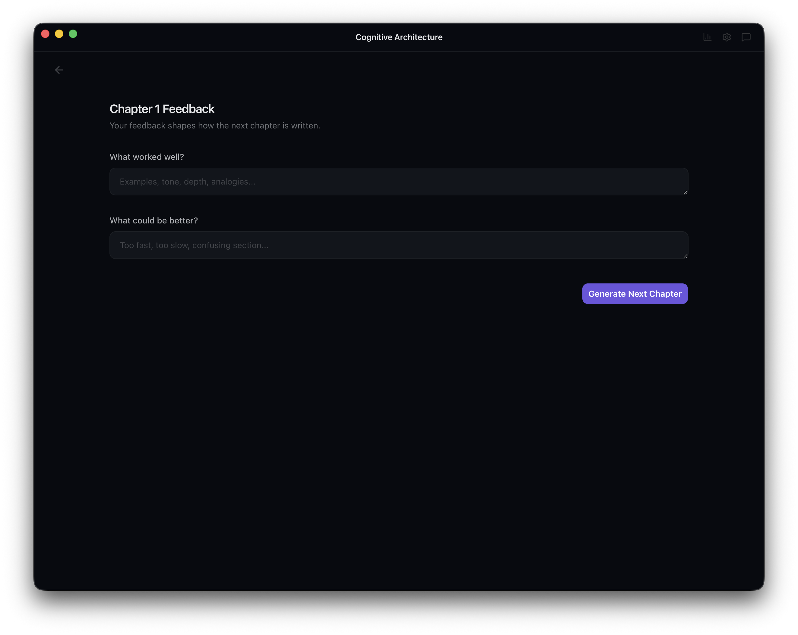

<!--
Show the feedback form.
"Natural language. No checkboxes. The user says what they think
and the AI incorporates it into the next chapter."
-->

---

<!-- BLANK 8: THE INLINE CHAT -->

## The Inline Chat Blank

Bring AI to the user, don't send the user to a chatbot

<!--
"You're reading. A sentence doesn't click. You tap it.
A panel slides out with that sentence already loaded as context.
Ask a question. Get an answer. Dismiss. Right back where you were.

Compare that to a chatbot: copy, paste, explain context, ask,
get answer, try to find your place again.

Where in your product do users get stuck?
Can you put help right there — not in a separate window?"
-->

---

<!-- _style: "section { padding: 0; }" -->

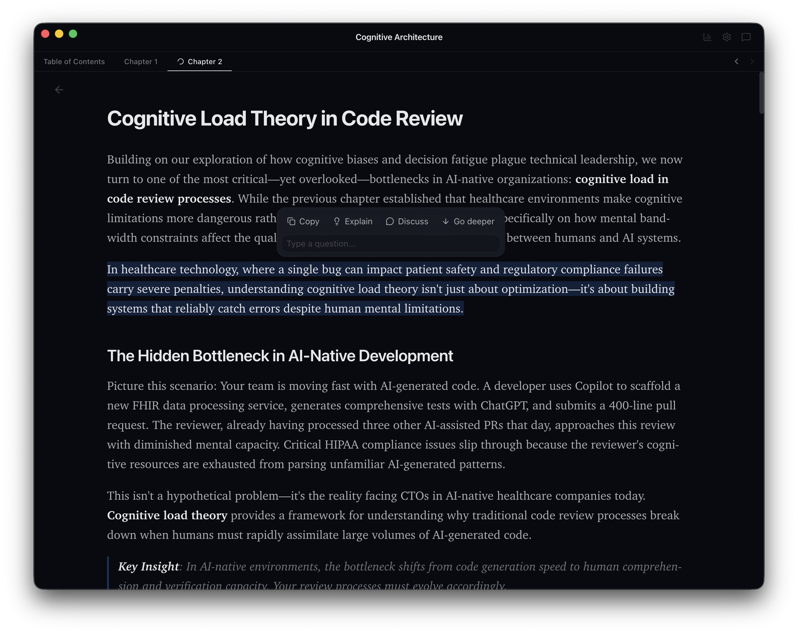

<!--
Show the text selection with the action menu: Copy, Explain, Discuss, Go deeper.
"You're reading. Something doesn't click. You select it.
An action menu appears — Explain, Discuss, Go deeper."
-->

---

<!-- _style: "section { padding: 0; }" -->

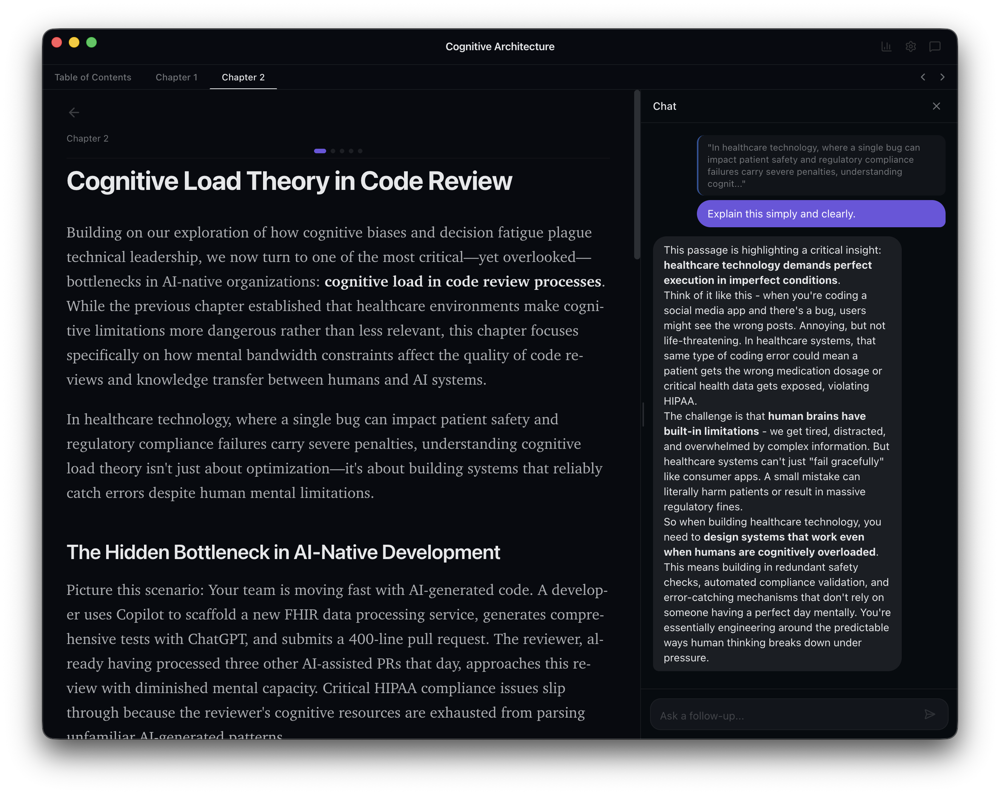

<!--
Show the chat panel open with a response.
"One click. The panel slides out. The sentence is already loaded as context.
The AI explains it simply. Dismiss. Right back where you were."
-->

---

## Where do your users get stuck?

Don't make them leave to get help

Put the blank where the confusion is.

<!--
"Think about where users get confused in your product.
Can you put AI help right there — inline, contextual, dismissible?

Don't build a chatbot page. Build a blank that appears
exactly where the user needs it."
-->

---

<!-- BLANK 9: THE PROFILE UPDATE -->

## The Profile Update Blank

Book 5 knows you better than book 1

<!--
"After finishing a book, your learning profile updates.
New skills. Refined preferences. Better understanding of how you learn.

Book one was good. Book five is uncanny.
The profile compounds — every book makes the next one better.

This is the blank that separates an AI product from an AI demo.
Demos are stateless. Products remember."
-->

---

<!-- _style: "section { padding: 0; }" -->

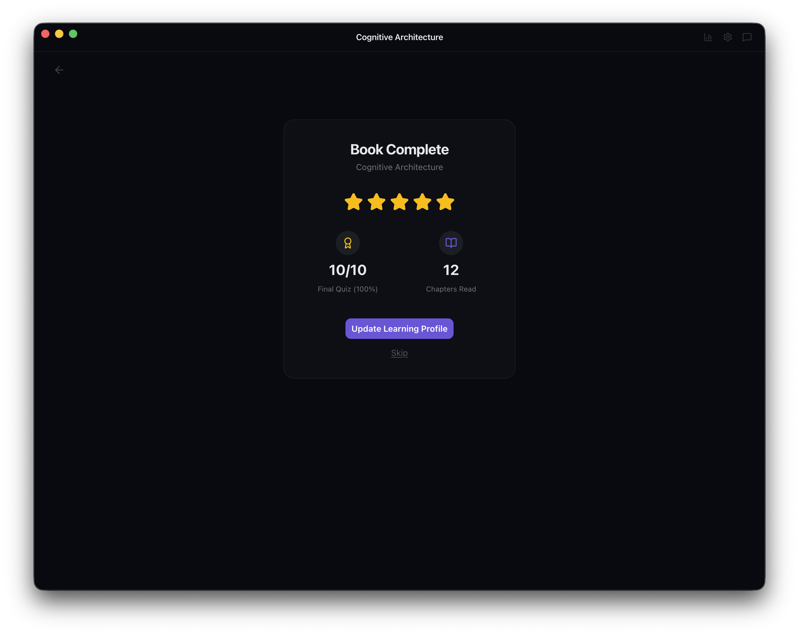

<!--
Show the Book Complete screen: 10/10 quiz, 12 chapters, "Update Learning Profile" button.
"You finish a book. The app knows exactly how you did.
And it asks: update your learning profile?"
-->

---

<!-- _style: "section { padding: 0; }" -->

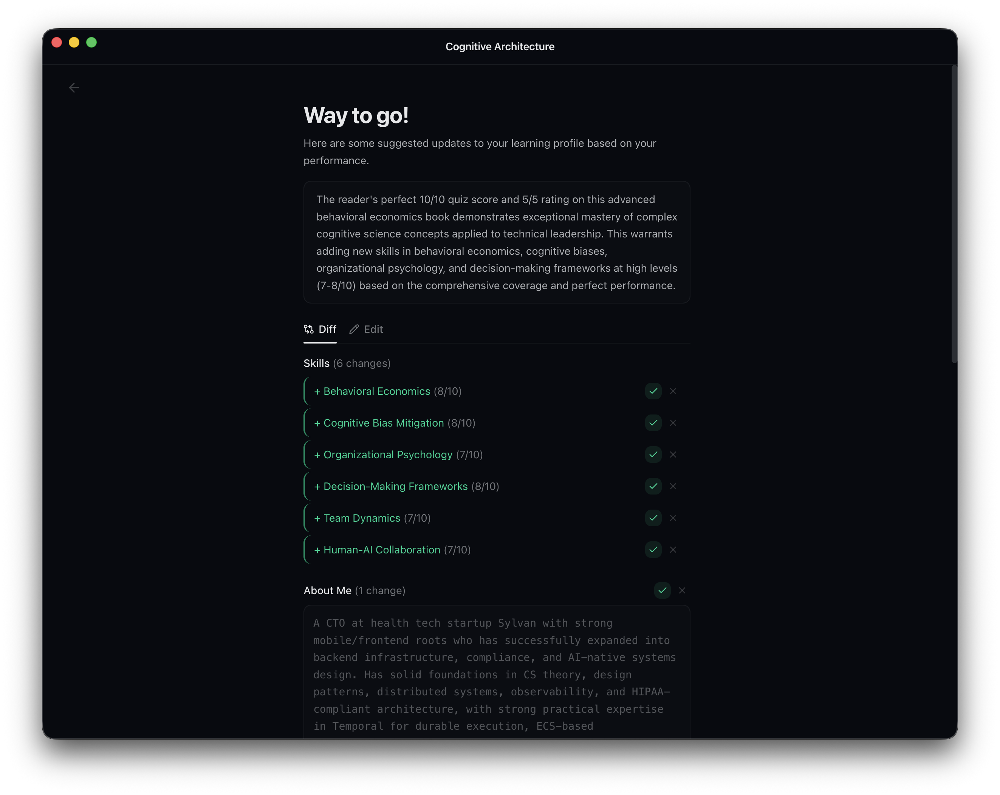

<!--
Show the skills diff — new skills being added with checkmarks.
"Six new skills added. Proficiency levels estimated from your quiz performance.
Every book leaves a trace. The profile grows. The AI gets better."
-->

---

Thanks

rossmiller.dev/tutor

Scan for slides &amp; source

<!--
Leave up during Q&A. Replace qr-placeholder.png with a real QR code.

"Design your blanks. The API is the easy part.
Which blanks you choose, what shape you give them,
and what signals you feed back in — that's the product."
-->
